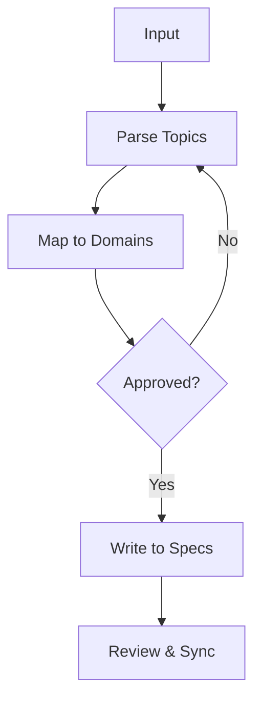

# Specification Workflow

Universal process for managing project specifications in `.design/specifications/`.

> **Scope**: Specification authoring structure and lifecycle. Task phasing is handled by `task.md`.

## Core Invariants (MUST FOLLOW)

- **Context**: flag > `MAGIC_WORKSPACE` > `.design/workspace.json` default > fallback root `.design/`. Never ask user.
- **Prohibitions**: No implementation code in specs; use pseudo-code only. No modification of `INDEX.md`, `PLAN.md` or live specs during "Explore/Analyze" modes.
- **Auto-Init**: If `.design/` or system files missing, auto-trigger `.magic/init.md`.
- **Integrity (C14)**: If engine files (`.magic/`) modified, MUST run: `node .magic/scripts/executor.js update-engine-meta --workflow spec` (Smart History: redundant automated entries are skipped).
- **linking**: Every spec must be in `INDEX.md`. Map relations in `Related Specifications`.
- **Status**: Assign Draft/RFC/Stable/Deprecated. Follow transitions (D->R->S).
- **Dispatch**: Use "Raw Input" flow for unstructured ideas.
- **Ventilation (C21)**: Use `magic analyze` to trigger a deep consistency check.
- **Delta-Editing**: For files >200 lines, use search-replace. Mark with `[ADDED]`, `[MODIFIED]`, `[REMOVED]`.
- **Closure**: Every task ends with mandatory "Task Completion Checklist".
- **Rules**: `RULES.md` is the project constitution. Check before every operation. Apply triggers T1-T4.

## Directory Structure

```plaintext
.design/
├── INDEX.md # Registry: what specs exist and their status
├── RULES.md # Constitution: how spec work is governed
├── PLAN.md # Implementation plan (managed by Plan Workflow)
├── specifications/ # Spec files
│   └── *.md
├── TASKS.md # Master task index
└── tasks/ # Task files (managed by Task Workflow)
    └── phase-{n}.md # Per-phase task files
```

**System files and their roles:**

| File | Role | Updated by |
| :--- | :--- | :--- |
| `INDEX.md` | Central registry of all spec files | Every create/update |
| `RULES.md` | Project constitution and conventions | Defined triggers |

## Specification Layers

All specifications must declare their layer in the metadata header using `Layer:`.

- **Layer 1 (concept)**: Abstract requirements, business logic, and domain mechanics. Technology-agnostic. Can be ported to any stack.
- **Layer 2 (implementation)**: Concrete realization of a Layer 1 concept in a specific technology stack.
  - Must include an `Implements: {layer-1-file.md}` metadata field pointing to its Layer 1 parent.
  - Cannot enter `RFC` or `Stable` status until its parent Layer 1 specification is `Stable`.

## Status Lifecycle

All specification files must use one of the following statuses:

- **Draft** — work in progress, not ready for review.
- **RFC** *(Request for Comments)* — complete enough for team review, open for feedback and discussion.
- **Stable** — reviewed and approved; implementation can begin.
- **Deprecated** — superseded by another spec; kept for historical reference only.

Status transitions follow this flow:


```mermaid
graph LR
    Draft --> RFC --> Stable --> Deprecated
    RFC --> Draft
    Stable --> RFC
```

> **Amendment rule:** When a Stable spec receives substantive new requirements
> (minor or major version bump), its status reverts to `RFC` for re-review.
> Typo-only patches (0.0.X) do not require a status change.

## Workflow Steps

### Explore Mode (Brainstorming)

Use this workflow for safe exploration without violating the "Workflow Minimalism" rule.

### Project Analysis Delegation

**Trigger intent**: "/magic.analyze", "Analyze project", "Scan project", "Re-analyze", "Ventilate"

> **Delegation Rule**: If the user's intent is to analyze the *existing codebase* — **delegate to `.magic/analyze.md`**. Read that file and follow its workflow.

1. **Act as a thinking partner**: Use codebase reasoning tools (`Sequential Thinking`, `grep_search`) to deeply analyze the user's request.
2. **Draft safely**: Output thoughts directly to the chat or create a temporary `proposal.md` file in the agent's artifacts directory (never in `.design/`).
3. **Strict Prohibition**: You MUST NOT modify `INDEX.md`, `PLAN.md`, `TASKS.md`, or any live `.design/specifications/` documents.
4. **Transition**: Only update live specs when the user explicitly approves transitioning the brainstorm into a formal spec update (triggering *Dispatching from Raw Input* or *Updating an Existing Specification*).

### Dispatching from Raw Input

Handle unstructured input (thoughts, notes) by mapping them to spec domains.


```mermaid
graph TD
    A[Input] --> B[Parse Topics]
    B --> C[Map to Domains]
    C --> D{Approved?}
    D -->|Yes| E[Write to Specs]
    D -->|No| B
    E --> F[Review & Sync]
```

1. **Parse & Map**: Identify distinct topics and match to domains:
    - Arch/Modules → `architecture.md`
    - API/Contracts → `api.md`
    - DB/Schema → `database-schema.md`
    - UI/Style → `ui-components.md`
2. **Confirm**: Show mapping and wait for approval.
3. **Dispatch**: Write to correct spec files using templates.
4. **Post-Update**:
    - Run **Post-Update Review**.
    - Check `RULES.md` triggers (T1-T4). If T4 found, update `RULES.md` first.
    - Sync `INDEX.md`.
    - Present **Task Completion Checklist**.

**Constraints**:

- **Ambiguity**: Ask one clarifying question; do not guess.
- **Conflict**: Flag contradictions with `RULES.md` or existing Stable specs. Intra-input: flag ALL conflicts within the same message before mapping. Never guess precedence.
- **T4 Rule**: If input contains "remember that...", group the rule update with the dispatch proposal for atomic approval. **Cross-Check**: Ensure the proposed specification logic immediately complies with the newly discovered rule before presenting the proposal.

### Creating a New Specification

1. **Pre-flight**: `node .magic/scripts/executor.js check-prerequisites --json`
    - `checksums_mismatch` → **HALT**. Restore integrity.
    - Missing `.design/` → Auto-Run `.magic/init.md`.
2. **Creation**:
    - Use \`.magic/templates/specification.md\` (Standard) or \`.magic/templates/micro-spec.md\` (Micro-spec as per C16).
    - Set \`Layer\` (1: Concept, 2: Impl). If L2, add \`Implements: {L1-file}\`.
    - Register in \`INDEX.md\` (Name, Status, Layer, Version).
3. **Closure**: Post-Update Review → Checklist.

### Updating an Existing Specification

1. **Pre-flight**: `check-prerequisites` (Same as Creation).
2. **Versioning**:
    - `patch` (0.0.X) — typos, no logic change.
    - `minor` (0.X.0) — extensions.
    - `major` (X.0.0) — breaking redesign.
    - Append row to `Document History`.
    - **Template Promotion (C16)**: If a Micro-spec grows beyond 50 lines or requires detailed architectural constraints, it MUST be converted to the Standard template (re-adding missing sections).
3. **Sync**:
    - Update `Version`, `Status`, `Layer` in `INDEX.md`.
    - **Existence Guard**: If target file is in `INDEX.md` but missing from disk → **HALT**. Ask user to restore or unregister.
    - **RESCUE (AOP)**: proactively check for renamed directories using similarity scan (>80%) and suggest a registry sync before halting.
    - **C12 (Quarantine)**: If L1 status drops (Stable → RFC/Draft), MUST drop status of all dependent L2/L3 specs to `RFC` or `Draft` to maintain Layer 2 stability requirements (§45, Step 52).
    - **Renaming/Merging/Splitting**: If file name or internal section structure changes:
        - Update all active refs in `INDEX.md`, `PLAN.md`, `TASKS.md`, active phase files, and `Related Specs`/`Implements` links.
        - **Refactoring Guard**: If moving sections between files, MUST update task references (e.g., `T-1A01`) in `TASKS.md` to reflect the new file/section mapping.
        - Exclude `RETROSPECTIVE.md` and `archives/` — historical logs are immutable.

### Post-Update Review (Mandatory)

Check for:

1. **Coherence**: Does it read consistently after edits?
2. **Links**: `Related Specifications` and `Implements` accurate?
3. **Rules**: Any contradiction with `RULES.md`? (Flag, don't ignore).
4. **Sync Check**: `check-prerequisites` status.

### Updating RULES.md (Constitution)

Update only via triggers. Never contradict §1-6 without explicit amendment.

| # | Trigger | Approval |
| :--- | :--- | :--- |
| T1-T3 | "Always/never", repeated pattern, or audit find | Propose & Wait |
| T4 | User rule: "remember that...", "project rule:" | Apply Immediately |

### Periodic Registry Audit

**Trigger**: *"Audit specs"* or every 5th update.

1. **Read**: All `INDEX.md` files + `RULES.md`.
2. **Check**:
    - Compliance with `RULES.md`.
    - Cross-file duplication.
    - Orphaned sections (no ref in features/plan).
    - Stale statuses (no update in `Draft/RFC`).
    - Broken `Related Specifications` links.
3. **Report**: `- {file} §{section}: {issue} → {fix}`.

### Consistency Check (Pre-flight)

Compares specs vs. project filesystem and engine integrity.

**Trigger**: `magic.task` auto-run or *"Verify specs"*.

| Check | Action |
| :--- | :--- |
| Path Validity | Referenced files exist? |
| Layer Integrity | L2 has valid L1 parent? |
| Registry Sync | `INDEX.md` entries match disk? |
| Config Sync | `package.json`/`pyproject.toml` fields match? |
| **Engine Integrity** | `.magic/` match `.checksums`? → **HALT** if mismatch. Hint: use `init` or `update-engine-meta`. |

### Task Completion Checklist

**Must be shown after every spec task.**

```
Checklist — {task description}
  ☐ No implementation code in specs (pseudo-code only)
  ☐ Registry: INDEX.md updated (Status, Layer, Version)
  ☐ Lifecycle: Status transitions valid (Draft -> RFC -> Stable) & C12 Quarantine applied
  ☐ Defensive: RULES.md triggers (T1-T4) checked/applied
  ☐ Engine: update-engine-meta run if .magic/ modified (C14)
  ☐ Review: Post-Update Review performed (Coherence, Duplication)
```

## Templates

> Specification template: `.magic/templates/specification.md` — read it when creating a new spec.
