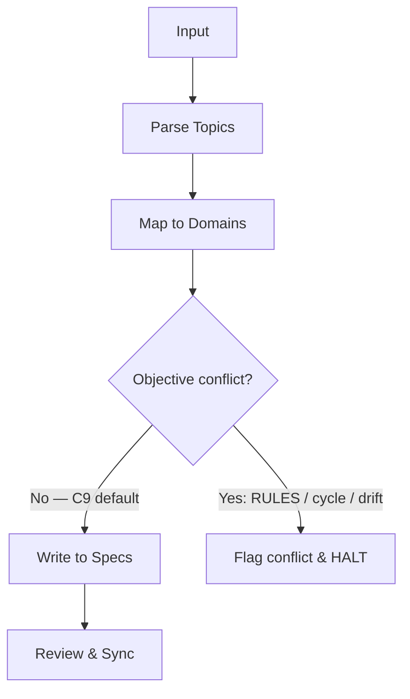

# Specification Workflow

Universal process for managing project specifications in `.design/specifications/`.

> **Scope**: Specification authoring structure and lifecycle. Task phasing is handled by `task.md`.
> **Executable projections:** [`workflows/magic.spec.md`](../workflows/magic.spec.md) · [`skills/magic.spec/SKILL.md`](../skills/magic.spec/SKILL.md)
> **Pipeline:** this → [`task.md`](task.md) → [`run.md`](run.md)

## Core Invariants (Mandatory)

1. **Context (Zero-Prompt)**: Apply the workspace resolution chain from [context.md](context.md) (Priority 1-4, Disambiguation, Scope Auto-Apply).
2. **Prohibitions**: No implementation code in specs; use pseudo-code for internal logic. **TECHNICAL CONTRACTS** (interfaces, types, API schemas, and reference snippets clearly marked as `[REFERENCE]`) are **PERMITTED** to ensure architectural precision. Unformatted/active implementation code detected → **HALT**. No modification of `INDEX.md`, `PLAN.md`, `TASKS.md`, or live specs during "Explore/Analyze" modes.
3. **Auto-Init**: If `.design/` or system files missing, silently execute `.magic/init.md` (do not prompt user).
4. **Engine Integrity (C14)**: If `.magic/` or `workflows/` modified → `node .magic/scripts/executor.js update-engine-meta`.
5. **Linking**: every spec must be in `INDEX.md`. Map relations in `Related Specifications`.
6. **Status**: assign Draft/RFC/Stable/Deprecated. Follow transitions (D→R→S).
7. **Dispatch**: use the "Raw Input" flow for unstructured ideas.
8. **Ventilation**: use `magic.analyze` to trigger a deep consistency check. See `.magic/analyze.md` Mode C.
9. **Delta-Editing**: for spec files >200 lines, use search-replace instead of full rewrites. Mark changed sections with `[ADDED]`, `[MODIFIED]`, `[REMOVED]`.
10. **Closure**: every task ends with a mandatory "Task Completion Checklist".
11. **Rules**: `RULES.md` is the project constitution. Check before every operation. Apply triggers T1-T4.
12. **Anti-Stall**: If user intent is captured and the agent has asked ≥1 clarifying question without writing any spec file, the agent MUST write a Draft spec on the next turn. Mark uncertain sections with `<!-- TBD: {question} -->` inline. Never block file creation on technical ambiguity.

## Directory Structure

```plaintext
.design/
├── INDEX.md # Global Registry: aggregates all workspaces
├── RULES.md # Constitution: how project specification is governed
├── workspace.json # Workspace configuration registry
├── main/ # Primary/default workspace
│   ├── INDEX.md # Workspace-specific registry
│   ├── PLAN.md # Implementation plan for main
│   ├── specifications/ # Spec files
│   │   └── *.md
│   ├── TASKS.md # Master task index
│   └── tasks/ # Task files
│       └── phase-{n}.md # Per-phase task files
└── {other-workspaces}/ # Added as needed
```

| File | Role | Updated by |
| --- | --- | --- |
| `INDEX.md` | Central registry of all spec files | Every create/update |
| `RULES.md` | Project constitution and conventions | Defined triggers |

## Specification Layers

Every spec declares its layer in metadata via `Layer:`.

- **Layer 1 (concept)**: abstract requirements, business logic, domain mechanics. Technology-agnostic; portable to any stack.
- **Layer 2 (implementation)**: concrete realization of an L1 concept in a specific tech stack. Must include `Implements: {l1-file.md}` pointing to its L1 parent. Cannot enter `RFC` or `Stable` until its L1 parent is `Stable`.

> **Workflow tooling**: specs are created/managed via `workflows/magic.spec.md` (skill: `skills/magic.spec/SKILL.md`). Orchestrated by `workflows/magic.task.md`, executed by `workflows/magic.run.md`, rule governance by `workflows/magic.rule.md`, health audited by `workflows/magic.analyze.md`.

## Status Lifecycle

Spec statuses:

- **Draft** — work in progress, not ready for review.
- **RFC** *(Request for Comments)* — complete enough for team review, open for feedback.
- **Stable** — reviewed and approved; implementation can begin.
- **Deprecated** — superseded by another spec; kept for historical reference only.

Transition flow:


```mermaid
graph LR
    Draft --> RFC -- "Auto or Approved" --> Stable --> Deprecated
    RFC --> Draft
    Stable --> RFC
```

> **Trust Mode (C9)**: when no objective conflicts exist (no RULES.md contradiction, no hard-dependency circular dependency, no VERSION_DRIFT), the agent may auto-promote statuses (Draft → Stable) silently to minimize user friction. Soft reference cycles (`Related Specifications` mutual links) do NOT block promotion.
>
> **Minimum Viable Completeness (MVC)**: a spec passes Trust Mode auto-promotion if it has `Overview` + at least one substantive design section (`Core Invariants` for L1, `Invariant Compliance` for L2, or `Detailed Design`). For non-standard layers (`test`, `tool`, etc.), MVC requires `Overview` + at least one numbered section with substantive content. Missing optional sections (`Drawbacks & Alternatives`, `Implementation Notes`) do not block. Allows early-stage specs with solid design content to advance without requiring every template section to be filled.
>
> **Amendment rule**: when a Stable spec receives substantive new requirements (minor or major version bump), its status reverts to `RFC` for re-review. Typo-only patches (0.0.X) do not require a status change.

## Workflow Steps

### Step 0: Workspace Intent Detection (Mandatory Pre-Step)

> Governed by the Workspace Intent Routing protocol (WI-1 through WI-10). Run for every spec create/update/dispatch operation BEFORE any other step.

Apply `context.md` §Step 0 Workspace Intent Detection:

1. Scan the user's most recent input + the workflow argument for signal classes (creation token, stack delta, domain delta).
2. Resolve to one of `existing:{name}` · `create:{name}` · `ambiguous`.
3. On `create:{name}` → invoke `create-workspace` BEFORE any spec authoring. Narrate: `[Workspace] Created '{name}' for {reason} (mentioned: {signal-token}). Dispatching new specs to .design/{name}/. (Revert: git restore .design/workspace.json && rm -rf .design/{name})`.
4. On `ambiguous` → ask the WI-4 three-option question. User picks 1, 2, or 3. Option 3 cancels the entire spec operation; the agent does NOT propose alternatives — it waits for the user's next message.
5. On `existing:{name}` → proceed with `{name}` resolved. Apply WI-7 Workspace Fit Validation just before the actual file write (Step Creating / Updating below).

The detection result is recorded in the agent's working state for the remainder of the workflow invocation. No subsequent step re-runs Step 0 within the same invocation.

### Explore Mode (Brainstorming)

Use this workflow for safe exploration. In **Trust Mode (C9)**, the agent strives for maximum speed from idea to execution.

**Blank Trigger (Creative Spark)**: triggered without specific input/arguments → become a **Proactive Architect**.

1. Scan `INDEX.md` and actual project structure.
2. Identify "Uncovered" modules or logical next steps in the architecture.
3. Surface up to 3 candidate "Creative Sparks" (topics for new specs or refinement) as a brief declarative list, then **rank them by DA-3 and select the highest-coverage gap in the same turn**, narrate the choice as a Decision Record (`[DR] Specifying {spark} — highest-coverage gap (DA-3). (Override: /magic.spec amend {other})`), and proceed to Dispatch. This is a Selection fork (DA-9, `l1-decision-autonomy.md`): a blank/no-argument invocation resolves by DA-3, **never** by an `AskUserQuestion` or option menu asking which spark to pursue. The user's redirect arrives as an interrupt (C25 §5), not a solicited answer — do not stall on confirmation (C9 default).

### Mode Transition: Explore → Dispatch

Explore Mode ends automatically; the agent MUST transition to Dispatching/Writing when:

1. User provides specific logic, features, or architectural constraints — **transition on first concrete-input message**, do not wait for additional exchanges.
2. **Auto-Transfer (C9 default)**: if the user's reply is ambiguous or restates intent without new content, write a Draft spec immediately with `<!-- TBD: {open question} -->` markers and proceed to Dispatch. Never stall on a 2nd "are you sure?" cycle — the transition is narrated, never posed as a question (DA-9).

### Project Analysis Delegation

**Trigger intent**: "/magic.analyze", "Analyze project", "Scan project", "Re-analyze", "Ventilate".

> **Delegation Rule**: if the user's intent is to analyze the *existing codebase* — **delegate to `.magic/analyze.md`**. Read that file and follow its workflow.

1. **Act as a thinking partner**: use available codebase reasoning tools (file search, content search, directory listing) to deeply analyze the user's request.
2. **Draft safely**: output thoughts directly to chat or create a temporary `proposal.md` file in the agent's artifacts directory (never in `.design/`).
3. **Actionable Guard (Analysis Mode ONLY)**: while in this delegated analysis mode, you MUST NOT modify `INDEX.md`, `PLAN.md`, `TASKS.md`, or any live `.design/specifications/` documents. Restriction is lifted immediately upon transition to Spec/Dispatch modes.
4. **Transition**: only update live specs when the user explicitly approves transitioning the brainstorm into a formal spec update (triggering *Dispatching from Raw Input* or *Updating an Existing Specification*).

### Dispatching from Raw Input

Handle unstructured input (thoughts, notes) by mapping them to spec domains.
*(Task analog: Decomposition with Validation Tasks in `task.md` — same input-to-units pattern.)*


```mermaid
graph TD
    A[Input] --> B[Parse Topics]
    B --> C[Map to Domains]
    C --> D{Objective conflict?}
    D -->|No — C9 default| E[Write to Specs]
    D -->|Yes: RULES / cycle / drift| G[Flag conflict & HALT]
    E --> F[Review & Sync]
```

1. **Parse & Map**: identify distinct topics and match to domains.
2. **Dispatch Notice (Non-Blocking)**: show the mapping as a concise "Dispatch Notice" (spec → file). If no objective conflicts (RULES.md contradiction, Circular Dependencies, VERSION_DRIFT) are found, the agent MUST proceed to write files immediately. In Trust Mode (C9), this is a statement of action, not a question — a declarative proposal surface (DA-9), never an `AskUserQuestion`.
3. **Dispatch**: write to correct spec files. Provisionally mark `Stable`-eligible if all of: (a) no RULES.md conflicts, (b) no circular dependencies, (c) layer constraints satisfied, (d) spec content satisfies MVC criteria (Overview + design section); otherwise keep as `Draft`. The advance to `Stable` is **finalized only after Post-Update Review (Step 4) passes** — a critic or quality-pass failure reverts the spec to `Draft`/`RFC` (see §Post-Update Review).
4. **Post-Update**:
   - Run **Post-Update Review**.
   - Check `RULES.md` triggers (T1-T4). If T4 found, update `RULES.md` first.
   - Sync `INDEX.md`.
   - **Zero-Prompt Handoff (C9 default)**: after dispatch completes, automatically invoke `/magic.task` to regenerate the plan. Narrate: `[Auto-Handoff] Specs Stable. Invoking /magic.task. (Interrupt: Ctrl+C)`. Hard-fork ambiguity (per C9 §3 — multiple incompatible architectural paths with no objective tiebreaker) is the only condition that pauses for user input.

**Constraints**:

- **Ambiguity (C25)**: do NOT ask clarifying questions about spec content. Record the open question as `<!-- TBD: {question} -->` inline within the Draft spec body and continue writing. (Objective-gate questions — workspace routing (WI-4), T4 tier routing, existence/parent guards, hard-fork — remain permitted per their own rules.) The user resolves TBDs by editing the Draft or invoking `/magic.spec amend`.
- **Conflict**: flag contradictions with `RULES.md` or existing Stable specs. Intra-input: flag ALL conflicts within the same message before mapping. Never guess precedence.
- **T4 Rule**: if input contains "remember that...", group the rule update with the dispatch proposal for atomic approval. Apply **T4 Inline Guards** (§Updating RULES.md) to determine target file and check for duplicates before writing. **Cross-Check**: ensure the proposed specification logic immediately complies with the newly discovered rule before presenting the proposal.
- **Actionable Outcome**: in Trust Mode (C9), after silent status promotion, append: `[Auto-SDD] {Spec} promoted to Stable; updated registry.`

### Creating a New Specification

1. **Pre-flight**: `node .magic/scripts/executor.js check-prerequisites --json --workspace {active-workspace}`.
   - `ok: true` → proceed to Cross-Workspace Parity check, then Creation.
   - `checksums_mismatch` → C15 Filter (`init.md §1`) → **HALT** ONLY if in-scope mismatches.
   - Missing `.design/` → silently execute `.magic/init.md` (do not prompt user), then resume.
   - **Cross-Workspace Parity**: if `workspace.json` registers >1 workspace, check whether an identically-named spec file already exists in any other workspace → auto-apply workspace-prefix naming and proceed. Narrate: `[Auto-SDD] Name collision on '{file}' (exists in '{ws}'): creating as '{active-workspace}-{file}'. (Override: /magic.spec amend to rename)`. Do NOT HALT; do NOT present option menus.
2. **Creation**:
   - Use `.magic/templates/spec.md` (Standard) or `.magic/templates/micro-spec.md` (Micro-spec per C16).
   - **Naming**: apply layer prefix (`l1-` Concept, `l2-` Impl) to the filename (e.g., `l1-api.md`).
   - Set `Layer` (1: Concept, 2: Impl). If L2, add `Implements: {L1-file}` using the prefixed name.
   - Register in `INDEX.md` (Name, Status, Layer, Version).
3. **Closure**: Post-Update Review → Checklist.

### Updating an Existing Specification

1. **Pre-flight**: `node .magic/scripts/executor.js check-prerequisites --json --workspace {active-workspace}`. `checksums_mismatch` → C15 Filter (`init.md §1`) → **HALT** ONLY if in-scope mismatches. If target spec is >200 lines, use delta-editing (search-replace) for all modifications (Invariant 9) — full rewrites of files >200 lines are NOT permitted.
2. **Versioning**:
   - `patch` (0.0.X) — typos, no logic change.
   - `minor` (0.X.0) — extensions.
   - `major` (X.0.0) — breaking redesign.
   - Append row to `Document History`.
   - **Template Promotion (C16)**: if a Micro-spec grows beyond 50 lines or requires detailed architectural constraints, it MUST be converted to the Standard template (re-adding missing sections).
3. **Sync**:
   - Update `Version`, `Status`, `Layer` in `INDEX.md`.
   - **Version Drift Guard**: VERSION_DRIFT detected for the target file **or any spec in its `Related Specifications` / `Implements` dependency chain** (file header `Version:` or `Status:` ≠ `INDEX.md` entry) → **HALT** before writing any updates. Report: *"Version drift on `{file}`: file header v{X} ≠ registry v{Y}. Run `/magic.spec` to reconcile — it will sync `INDEX.md` to the file header version and apply the amendment rule to capture the external change."* Resume only after user resolves.
     - **Resolution Validation**: before resuming, confirm INDEX.md entry now matches the file header. If the file header was updated without review, flag: *"Drift resolved via registry sync. External change to `{file}` between v{Y} and v{X} was not reviewed — confirm before proceeding."* After confirmed resolution, **re-evaluate all Sync guards from the top, scoped to the amendment target** (RE-3, Cross-Workspace Parity, Existence Guard, and C12 Quarantine applied to the amendment target's upward chain — its L1 parents only, not its downstream dependents nor the drift-resolved file that triggered the HALT) before writing.
     - **T4 Queue**: if the triggering input also contained a T4 rule ("remember that..."), acknowledge it explicitly: *"T4 rule detected — queued pending drift resolution."* Do NOT write to `RULES.md` until the drift is resolved. Apply the queued rule immediately after.
   - **Cross-Workspace Parity**: if `workspace.json` registers >1 workspace, check whether an identically-named spec file exists in any other workspace. Name collision with version mismatch → **HALT**. Report: *"Source of Truth Drift: `{file}` exists in `{ws-a}` (v{X}) and `{ws-b}` (v{Y}). Run `/magic.spec` in `{ws-a}` (higher version) to reconcile, then re-run the update."* One path, no option menu.
   - **Existence Guard**: target file in `INDEX.md` but missing from disk → **HALT**. Ask user to restore or unregister.
   - **Parent Existence Guard**: target is L2, verify its L1 parent (defined in `Implements:`) exists on disk in the specified (or resolved) workspace. Parent missing → **HALT**. Report: *"L2 Orphan: Parent spec `{parent-file}` is missing from disk. Restore parent before updating L2."*
     - **T4 Queue**: if the triggering input also contained a T4 rule, acknowledge it: *"T4 rule detected — queued pending file resolution."* Do NOT write to `RULES.md` until the Existence Guard is resolved. Apply the queued rule immediately after the target file (and parent) is restored or remapped.
   - **RESCUE (AOP)**: proactively check for renamed directories by comparing path segments (Levenshtein distance ≤20% of length) and suggest a registry sync before halting.
   - **C12 (Quarantine)**: if L1 status drops (Stable → RFC/Draft):
     1. Scan `INDEX.md` for ALL specs with `Implements: {target-file}` (full registry scan — not open-file only).
     2. For each L2 found, recursively repeat: scan for `Implements: {L2-file}` to discover L3 dependents.
     3. **Update INDEX.md**: set status of all discovered dependents to match parent's new status (`RFC` or `Draft`). Update file headers to match. This **downward** cascade is the authoritative status change — `task.md` and `run.md` react to C12/deprecation status drops, they never reverse them. (Upward `Draft → Stable` promotion is owned by `task.md` Pre-Planning Stabilization / `spec.md` Batch Stabilization.)
     4. Report: *"C12 Cascade: {N} dependents quarantined: [{list}]."*
   - **Deprecation Cascade**: if a spec transitions to `Deprecated`:
     1. Scan `INDEX.md` for ALL specs with `Implements: {target-file}` — flag each as having an **invalid L1 parent** (layer integrity violation). Report: *"L2 `{file}` has no valid L1 parent — `{target}` is Deprecated."*
     2. Scan `INDEX.md` for ALL specs with `Related Specifications` referencing `{target-file}` — flag each as containing a **stale reference**. Report: *"`{file}` references Deprecated spec `{target}` in Related Specifications."*
     3. Proceed with the deprecation — do NOT block. Findings are surfaced in the mandatory Post-Update Review as actionable warnings with suggested next steps: `→ /magic.spec amend {file}` (remove stale ref) or `→ /magic.spec deprecate {file}` (cascade further).
   - **Renaming/Merging/Splitting**: if file name or internal section structure changes:
     - Update all active refs in `INDEX.md`, `PLAN.md`, `TASKS.md`, active phase files, and `Related Specs`/`Implements` links.
     - **Refactoring Guard**: if moving sections between files, MUST update task references (e.g., `T-1A01`) in `TASKS.md` to reflect the new file/section mapping.
     - Exclude `RETROSPECTIVE.md` and `archives/` — historical logs are immutable.

### Batch Stabilization

**Trigger**: called from `task.md` Pre-Planning Stabilization (Step 2), or `/magic.spec stabilize [workspace]`.

Promotes multiple `Draft` specs to `Stable` in a single pass, applying Trust Mode (C9) criteria consistently.

1. **Resolve Scope**: if workspace specified, iterate only that workspace's `INDEX.md`. Otherwise, iterate all workspaces.
2. **Layer-Ordered Iteration**: process all **L1 (concept)** specs first, then **L2 (implementation)** specs. Ensures L1 parents are `Stable` before their L2 children are evaluated.
3. **Per-Spec Evaluation**:
   - (a) No `RULES.md` contradictions.
   - (b) No hard-dependency cycles (`Implements:` chains only — soft `Related Specifications` cycles are non-blocking).
   - (c) Layer constraints: L2 has valid `Implements:` field pointing to a `Stable` L1 parent.
   - (d) MVC satisfied: `Overview` + at least one substantive design section.
   - **Pass** → provisionally promote `Draft → Stable` — finalized after the step-6 Post-Update Review; a review failure reverts to `Draft`/`RFC`. Update file header `Status:` and `INDEX.md` entry atomically.
   - **Fail** → skip. Log reason: `[Batch-Skip] {file}: {criterion} failed — {details}.`
4. **Field Normalization**: if an L2 spec uses a non-standard parent reference field (e.g., `L1 Reference:` instead of `Implements:`), auto-rename to the canonical `Implements:` field.
5. **Report**: `[Batch-Stabilize] {N} promoted, {M} skipped. Skipped: [{file}: {reason}, ...].`
6. **Post-Update Review**: run on all promoted specs (batch — not individually).

### Post-Update Review (Mandatory)

Activate `@role:spec-critic` to audit the changes. *(C24 pattern analog: Planning Audit in `task.md` uses `@role:planner` — same adversarial review, different phase.)*

Check for:

1. **Layer 1 Purity (L1 only)**: are invariants strictly technology-neutral? Remove any implicit implementation assumptions or specific stack references.
2. **Invariant Completeness**: are all edge cases, error states, and boundary conditions covered by the specification invariants?
3. **Substantive Compliance (L2 only)**: does the `Invariant Compliance` table provide meaningful verification details for each L1 point, or is it just a formal placeholder?
4. **Coherence**: does the document read consistently after edits?
5. **Links**: `Related Specifications` and `Implements` accurate?
6. **Rules**: any contradiction with `RULES.md`? (Flag, don't ignore.)
7. **Sync Check**: `check-prerequisites` status.

Any check fails → report as `[Spec-Review] {file} §{section}: {issue}` and block status promotion. Retain current status (`Draft` or `RFC`); do not advance to `Stable` until all critic findings are resolved.

**Instruction Quality Pass (second stage)**: after `@role:spec-critic` emits PASS, activate `@role:prompt-engineer` over the created/amended spec sections — six-dimension review (contradictions, ambiguity, persona/tone consistency, cognitive load, semantic coverage, composition coherence) per the PQ-3 taxonomy. The quality pass never runs on critic-rejected specs (PQ-7 ordering). Verdict per PQ-6: PASS → proceed; PASS-WITH-REWRITES → apply the proposed rewrites within this invocation, then proceed; FAIL → blocks status promotion alongside critic findings.

### Graph Refresh (Post-Dispatch)

Any mutation of `.design/specifications/` or `INDEX.md` invalidates the spec graph and wiki. After dispatch (Creating, Updating, Batch Stabilization, T4 RULES.md write) and before the Task Completion Checklist, run the canonical refresh **once per workflow invocation**:

```bash
node .magic/scripts/executor.js export-wiki
```

Single call rebuilds the graph (cached extraction, ~ms per warm spec) and regenerates `.design/wiki/`. Best-effort — on failure log non-blocking warning (`[Graph-Refresh] export-wiki failed: {err}. Wiki may be stale.`) and continue.

Skip the refresh in **Explore Mode** and **Project Analysis Delegation** — both are read-only.

### Updating RULES.md (Constitution)

Update only via triggers. Never contradict §1-6 without explicit amendment.

| # | Trigger | Approval |
| --- | --- | --- |
| T1-T3 | "Always/never", repeated pattern, or audit find | Propose & Wait |
| T4 | User rule: "remember that...", "project rule:" | Apply Immediately |

**T4 Inline Guards** (applied before writing, preserving "Apply Immediately" semantics):

1. **Tier Routing**: determine target file using the same logic as `rule.md` §Rule Tier Routing — if rule text contains workspace signal words ("in engine", "for docs", etc.) or current workspace context is specific → write to `.design/{workspace}/RULES.md`. If rule is universal → write to `.design/RULES.md`. Ambiguous → ask user.
2. **Duplication Check**: read both global and workspace RULES.md (if exists). If proposed rule semantically overlaps with any existing C{N} or WC{N} → surface the overlap and ask: merge, replace, or add separately. Do NOT silently duplicate.
3. **Constitutional Guard**: if proposed rule contradicts §1–6 → **HALT**. Same as `rule.md`.

### Periodic Registry Audit

**Trigger**: *"Audit specs"* or every 5th specification write operation (create, update, or status change — counted per conversation; counter resets when the chat session ends).

1. **Read**: all `INDEX.md` files + `RULES.md`.
2. **Check**:
   - Compliance with `RULES.md`.
   - Cross-file duplication.
   - Orphaned sections (no ref in features/plan).
   - Stale statuses (no update in `Draft/RFC`).
   - Broken `Related Specifications` links.
3. **Report**: `- {file} §{section}: {issue} → {fix}`.

### Consistency Check (Pre-flight)

Compares specs vs. project filesystem and engine integrity.
*(Pre-flight gate analog: Pre-Planning Stabilization in `task.md` — both block progression until invariants pass.)*

**Trigger**: `magic.task` auto-run or *"Verify specs"*.

| Check | Action |
| --- | --- |
| Path Validity | Referenced files exist? |
| Layer Integrity | L2 has valid L1 parent? |
| Registry Sync | `INDEX.md` entries match disk? |
| **Version Drift** | Spec file header `Version:` matches `INDEX.md` entry? Flag `VERSION_DRIFT` if mismatch — indicates external edit without lifecycle protocol. |
| Config Sync | Project configuration files match declared spec metadata? |
| **Engine Integrity** | `.magic/` matches `.checksums`? → C15 Filter (`init.md §1`) → **HALT** only if in-scope mismatches. (In `magic.analyze` Mode C this self-check is non-halting / audit-only.) Hint: use `init` or `update-engine-meta`. |

## Finalization Protocol (Mandatory)

After all workflow steps (incl. Graph Refresh) and **before** the Completion Checklist:

1. Run `node .magic/scripts/executor.js finalize --workflow=spec`. Output is either `✅ Finalization complete` (with version bump + CHANGELOG entry + suggested commit message) or `⏭️ No significant changes detected`.
2. **Display the entire script output verbatim** in a fenced block.
3. **Hard rule**: do NOT invoke `git commit`, `git add`, or any write-side git command — the user reviews the suggested message and commits manually.
4. Script exit non-zero → emit WARNING, do NOT block the Completion Checklist.

**Opt-out**: `MAGIC_FINALIZE=0` env var, or `finalization.enabled = false` in `.design/workspace.json`.

> **Note for `magic.run` Phase Completion**: `Changelog L1` in run.md appends to `.design/{ws}/CHANGELOG.md` (internal phase journal). This protocol appends to the **root** `CHANGELOG.md` (user-facing release notes). Separate documents; no conflict.

### Task Completion Checklist

**Must be shown after every spec task.**

```
Checklist — {task description}
  ☐ No implementation code in specs (pseudo-code for logic; contracts & references permitted)
  ☐ Registry: INDEX.md updated (Status, Layer, Version)
  ☐ Lifecycle: Status transitions valid (Draft -> RFC -> Stable) & C12 Quarantine applied
  ☐ Batch Stabilization: MVC criteria applied; field normalization done (if batch mode)
  ☐ Rules: RULES.md triggers (T1-T4) checked/applied
  ☐ Canonical References: If promoting to `Stable`, `## Canonical References` should be filled.
     Empty or stub rows → flag `CANONICAL_MISSING` (advisory, non-blocking — does NOT block promotion; matches `analyze.md` Mode C). MVC remains the sole batch/stabilization gate.
  ☐ Engine: update-engine-meta run if .magic/ or workflows/ modified (C14)
  ☐ Review: Post-Update Review performed by `@role:spec-critic` (Purity, Completeness, Compliance)
  ☐ Instruction Quality: dispatched sections reviewed by `@role:prompt-engineer` (PQ-6 verdict recorded)
  ☐ Graph: export-wiki run after dispatch (skip for Explore/Analysis Delegation read-only modes)
  ☐ Engineer Posture (C25): no clarifying prompts outside C9 objective gates; ambiguity recorded as TBD-markers
  ☐ Decision Autonomy (C27): elective forks resolved as [DR] one-liners; next step computed and narrated (DA-6), never asked
```

## Templates

> Specification template: `.magic/templates/spec.md` — read it when creating a new spec.
