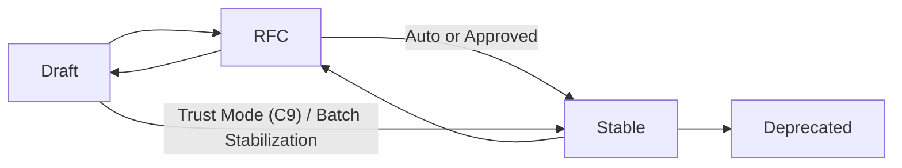
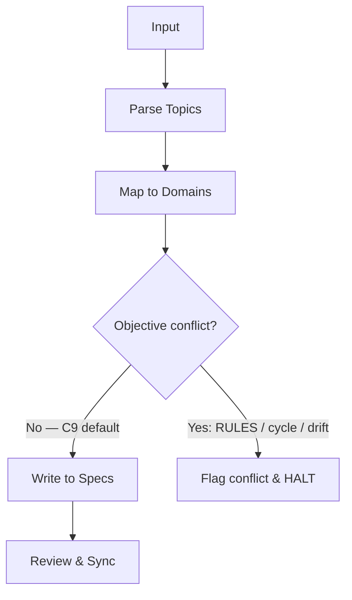

# Specification Workflow

Universal process for managing project specifications in `.design/specifications/`.

> **Scope**: Specification authoring structure and lifecycle. Task phasing is handled by `task.md`.
> **Executable projections:** [`workflows/magic.spec.md`](../workflows/magic.spec.md) · [`skills/magic-spec/SKILL.md`](../skills/magic-spec/SKILL.md)
> **Pipeline:** this → [`task.md`](task.md) → [`run.md`](run.md)

**Contents:**

- Core Invariants (Mandatory)
- Directory Structure
- Specification Layers
- Status Lifecycle
- Workflow Steps
- Finalization Protocol (Mandatory)
- Templates

## Core Invariants (Mandatory)

1. **Context (Zero-Prompt)**: Apply [context.md](context.md) as a whole — every section applies unless it names other workflows.
2. **Prohibitions**: No implementation code in specs; use pseudo-code for internal logic. **TECHNICAL CONTRACTS** (interfaces, types, API schemas, and reference snippets clearly marked as `[REFERENCE]`) are **PERMITTED** to ensure architectural precision. Unformatted/active implementation code detected → **HALT**. No modification of `INDEX.md`, `PLAN.md`, `TASKS.md`, or live specs during "Explore/Analyze" modes.
3. **Auto-Init**: If `.design/` or system files missing, silently execute `.magic/init.md` (do not prompt user).
4. **Engine Integrity (C14)**: If `.magic/` or `workflows/` modified → `node .magic/scripts/executor.js update-engine-meta`.
5. **Linking**: every spec must be in `INDEX.md`. Map relations in `Related Specifications`.
6. **Status**: assign Draft/RFC/Stable/Deprecated. Follow transitions (D→R→S).
7. **Dispatch**: use the "Raw Input" flow for unstructured ideas.
8. **Ventilation**: use `magic.analyze` to trigger a deep consistency check. See `.magic/analyze.md` Mode C.
9. **Delta-Editing**: for spec files >200 lines, use search-replace instead of full rewrites. Mark changed sections with `[ADDED]`, `[MODIFIED]`, `[REMOVED]`.
10. **Closure**: every task ends with a mandatory "Task Completion Checklist".
11. **Rules**: `RULES.md` is the project constitution. Check before every operation. Apply triggers T1-T4. Rules enter only through the admission gate (RA-1).
12. **Anti-Stall**: If user intent is captured and the agent has asked ≥1 clarifying question without writing any spec file, the agent MUST write a Draft spec on the next turn. Mark uncertain sections with `<!-- TBD: {question} -->` inline. Never block file creation on technical ambiguity. **Suspended only during an active IK-6 convergent dialogue** (Step 0.5 Idea Intake Gate) — and the moment that gate terminates, by empty set or by non-convergence, this invariant resumes at full force: the Draft is written on that turn, every open question answered by the forecast. A gate that fired without an IK-4 condition, or that continued past a non-convergent round, is an Anti-Stall violation, not an exemption.

## Directory Structure

```plaintext
.design/
├── INDEX.md # Global Registry: aggregates all workspaces
├── RULES.md # Constitution: how project specification is governed
├── workspace.json # Workspace configuration registry
├── main/ # Primary/default workspace
│   ├── INDEX.md # Workspace-specific registry
│   ├── PLAN.md # Implementation plan for main
│   ├── specifications/ # Spec files
│   │   └── *.md
│   ├── TASKS.md # Master task index
│   └── tasks/ # Task files
│       └── phase-{n}.md # Per-phase task files
└── {other-workspaces}/ # Added as needed
```

| File | Role | Updated by |
| --- | --- | --- |
| `INDEX.md` | Central registry of all spec files | Every create/update |
| `RULES.md` | Project constitution and conventions | Defined triggers |

## Specification Layers

Every spec declares its layer in metadata via `Layer:`.

- **Layer 1 (concept)**: abstract requirements, business logic, domain mechanics. Technology-agnostic; portable to any stack.
- **Layer 2 (implementation)**: concrete realization of an L1 concept in a specific tech stack. Must include `Implements: {l1-file.md}` pointing to its L1 parent. Cannot enter `RFC` or `Stable` until its L1 parent is `Stable`.

> **Workflow tooling**: specs are created/managed via `workflows/magic.spec.md` (skill: `skills/magic-spec/SKILL.md`). Orchestrated by `workflows/magic.task.md`, executed by `workflows/magic.run.md`, rule governance by `workflows/magic.rule.md`, health audited by `workflows/magic.analyze.md`.

## Status Lifecycle

Spec statuses:

- **Draft** — work in progress, not ready for review.
- **RFC** *(Request for Comments)* — complete enough for team review, open for feedback.
- **Stable** — reviewed and approved; implementation can begin.
- **Deprecated** — superseded by another spec; kept for historical reference only.

Transition flow:


```mermaid
graph LR
    Draft --> RFC -- "Auto or Approved" --> Stable --> Deprecated
    Draft -- "Trust Mode (C9) / Batch Stabilization" --> Stable
    RFC --> Draft
    Stable --> RFC
```

> **Trust Mode (C9)**: when no objective conflicts exist (no RULES.md contradiction, no hard-dependency circular dependency, no VERSION_DRIFT), the agent may auto-promote statuses (Draft → Stable) silently to minimize user friction. Soft reference cycles (`Related Specifications` mutual links) do NOT block promotion.
>
> **Minimum Viable Completeness (MVC)**: a spec passes Trust Mode auto-promotion if it has `Overview` + at least one substantive design section (`Core Invariants` for L1, `Invariant Compliance` for L2, or `Detailed Design`). For non-standard layers (`test`, `tool`, etc.), MVC requires `Overview` + at least one numbered section with substantive content. Missing optional sections (`Drawbacks & Alternatives`, `Implementation Notes`) do not block. Allows early-stage specs with solid design content to advance without requiring every template section to be filled.
>
> **Amendment rule**: when a Stable spec receives substantive new requirements (minor or major version bump), its status reverts to `RFC` for re-review. Typo-only patches (0.0.X) do not require a status change.

## Workflow Steps

### Step 0: Workspace Intent Detection (Mandatory Pre-Step)

> Governed by the Workspace Intent Routing protocol (WI-1 through WI-10). Run for every spec create/update/dispatch operation BEFORE any other step.

Apply `context.md` §Step 0 Workspace Intent Detection:

1. Scan the user's most recent input + the workflow argument for signal classes (creation token, stack delta, domain delta).
2. Resolve to one of `existing:{name}` · `create:{name}` · `ambiguous`.
3. On `create:{name}` → invoke `create-workspace` BEFORE any spec authoring. Narrate: `[Workspace] Created '{name}' for {reason} (mentioned: {signal-token}). Dispatching new specs to .design/{name}/. (Revert: git restore .design/workspace.json && rm -rf .design/{name})`.
4. On `ambiguous` → resolve it by the Consequence Forecast (WI-4, C27 DA-10) over `create:{X}`, `existing:{Y}` and no dispatch, exactly as `context.md` §Ambiguity Gate states; narrate `[DR] Routed '{artifact}' to '{winner}' — {criterion}; worst case if wrong: {cost}; runner-up: {candidate}. (Override: /magic.spec {runner-up-workspace} …)` and carry the routing premise into the dispatched spec's `Constraints & Assumptions`. Nothing is asked.
5. On `existing:{name}` → proceed with `{name}` resolved. Apply WI-7 Workspace Fit Validation just before the actual file write (Step Creating / Updating below).

The detection result is recorded in the agent's working state for the remainder of the workflow invocation. No subsequent step re-runs Step 0 within the same invocation.

### Step 0.5: Idea Intake Gate (E6)

> Governed by the Idea Intake Gate protocol (IK-1 through IK-9). Runs after Step 0, before any mode branch. Skipped entirely when the invocation carries no idea (blank trigger, `stabilize`, `amend {file}` with no new content). This is the one place outside consent where the engine asks: the requester has just supplied the idea and is present, nothing is built yet, and the missing piece is intent only they hold. The Consequence Forecast (C27 DA-10) writes the options and answers whatever the requester delegates.

**Silent by default (IK-1)**: this is an evaluation, not a stage. When no firing condition holds — the common case — proceed to dispatch in the same turn with no narration. Never announce that the gate ran clean.

1. **Investigate first (IK-2)**: before composing any question, exhaust what the repository can answer — global + workspace `RULES.md`, workspace `INDEX.md`, specs on the idea's topic, the spec graph, the source tree. A question is legitimate only for what cannot exist in the repository: the user's intent. *"I did not read the specs"* is never grounds to ask.
2. **Gate 1 — comprehension (IK-4)**: is the idea understood?
   - **F1 Incoherence** — the idea is internally contradictory, or admits no single coherent reading.
   - **F2 Essence ambiguity** — ≥2 coherent readings yield **materially different** specs. *Test*: draft the one-sentence Overview each reading produces. Same sentence → detail-level, no fire. Different sentence → fire.
3. **Gate 2 — sufficiency (IK-4)**: is the input enough? **F3** fires for each intent anchor — who it is for, what it must do, where it stops — whose sentence would have to be invented (*test*: it cannot be quoted from the input, found in the repository, or taken as the default any engineer would assume).
   - No condition holds in either gate → record any residual doubt as `<!-- TBD: {question} -->` and dispatch.
4. **Ask one survey round (IK-3, IK-5)**: at most three questions — one per open point — in plain words, about intent only: what is built, for whom, where it stops, what "working" looks like, which conflicting requirement wins. **Never** ask storage format, library, schema, naming, algorithm, layer or test strategy — the engineer decides those via DA-3 and records a TBD or `[DR]`. Each question's options are the Consequence Forecast's candidates — each reading and, where one exists, the **hedge** — with the forecast's winner marked as recommended, each option's consequence stated, and a free-text **Other: …** last. Any question may be skipped or delegated ("you decide"). Ask what the user wants **built**, never what the agent **should do**.
5. **Converge or stop (IK-6)**: a chosen option closes its question; an **Other** answer is new human text and goes back through Gates 1 and 2 before it closes anything. The open set MUST be strictly smaller at each round's end than at its start — closing one while opening two is not convergence. A non-convergent reply (restated intent, `"you decide"`, an unmappable or off-topic answer) **ends the gate**: every question still open is answered by the forecast's winner and recorded in the Draft's `Constraints & Assumptions` as `- **Assumption (forecast):** {premise}. Runner-up: {other reading}. Override: /magic.spec amend {file} "{runner-up}"` — at most three such bullets, any further point marked TBD.
6. **State the understood idea, then write (IK-7)**: when the gate fired, narrate once `[Intake] Understood as: {one paragraph}` — the intent statement that seeds the Overview — and write the Draft on that turn. Answers live in the spec's own voice; no `Clarifications` section, no brief file, no log.

**Scope containment (IK-8)**: E6 fires only on the content of a freshly supplied idea. It never covers the agent's own workflow choices (which spec, which phase, which order), proposal surfaces, or drift offers — those remain declarative `[DR]` narrations under DA-9.

### Explore Mode (Brainstorming)

Use this workflow for safe exploration. In **Trust Mode (C9)**, the agent strives for maximum speed from idea to execution.

**Blank Trigger (Creative Spark)**: triggered without specific input/arguments → become a **Proactive Architect**.

1. Scan `INDEX.md` and actual project structure.
2. Identify "Uncovered" modules or logical next steps in the architecture.
3. Surface up to 3 candidate "Creative Sparks" (topics for new specs or refinement) as a brief declarative list, then **rank them by DA-3 and select the highest-coverage gap in the same turn**, narrate the choice as a Decision Record (`[DR] Specifying {spark} — highest-coverage gap (DA-3). (Override: /magic.spec amend {other})`), and proceed to Dispatch. This is a Selection fork (DA-9): a blank/no-argument invocation resolves by DA-3, **never** by a question or option menu (e.g. an `AskUserQuestion` call) asking which spark to pursue. The user's redirect arrives as an interrupt (C25 §5), not a solicited answer — do not stall on confirmation (C9 default).

### Mode Transition: Explore → Dispatch

Explore Mode ends automatically; the agent MUST transition to Dispatching/Writing when:

1. User provides specific logic, features, or architectural constraints — **transition on first concrete-input message**, do not wait for additional exchanges.
2. **Auto-Transfer (C9 default)**: if the user's reply is ambiguous or restates intent without new content, write a Draft spec immediately with `<!-- TBD: {open question} -->` markers and proceed to Dispatch. This is IK-6's termination rule seen from Explore Mode: never continue a round that did not shrink the open-question set — the bound is non-convergence, not a round count, so a dialogue that keeps closing questions may continue. The transition is narrated, never posed as a question (DA-9).

### Project Analysis Delegation

**Trigger intent**: "/magic.analyze", "Analyze project", "Scan project", "Re-analyze", "Ventilate".

> **Delegation Rule**: if the user's intent is to analyze the *existing codebase* — **delegate to `.magic/analyze.md`**. Read that file and follow its workflow.

1. **Act as a thinking partner**: use available codebase reasoning tools (file search, content search, directory listing) to deeply analyze the user's request.
2. **Draft safely**: output thoughts directly to chat or create a temporary `proposal.md` file in the agent's artifacts directory (never in `.design/`).
3. **Actionable Guard (Analysis Mode ONLY)**: while in this delegated analysis mode, you MUST NOT modify `INDEX.md`, `PLAN.md`, `TASKS.md`, or any live `.design/specifications/` documents. Restriction is lifted immediately upon transition to Spec/Dispatch modes.
4. **Transition**: only update live specs when the user explicitly approves transitioning the brainstorm into a formal spec update (triggering *Dispatching from Raw Input* or *Updating an Existing Specification*).

### Dispatching from Raw Input

Handle unstructured input (thoughts, notes) by mapping them to spec domains.
*(Task analog: Decomposition with Validation Tasks in `task.md` — same input-to-units pattern.)*


```mermaid
graph TD
    A[Input] --> B[Parse Topics]
    B --> C[Map to Domains]
    C --> D{Objective conflict?}
    D -->|No — C9 default| E[Write to Specs]
    D -->|Yes: RULES / cycle / drift| G[Flag conflict & HALT]
    E --> F[Review & Sync]
```

1. **Parse & Map**: identify distinct topics and match to domains.
2. **Dispatch Notice (Non-Blocking)**: show the mapping as a concise "Dispatch Notice" (spec → file). If no objective conflicts (RULES.md contradiction, Circular Dependencies, VERSION_DRIFT) are found, the agent MUST proceed to write files immediately. In Trust Mode (C9), this is a statement of action, not a question — a declarative proposal surface (DA-9), never a question (e.g. an `AskUserQuestion` call).
3. **Dispatch**: write to correct spec files. Provisionally mark `Stable`-eligible if all of: (a) no RULES.md conflicts, (b) no circular dependencies, (c) layer constraints satisfied, (d) spec content satisfies MVC criteria (Overview + design section); otherwise keep as `Draft`. The advance to `Stable` is **finalized only after Post-Update Review (Step 4) passes** — a critic or quality-pass failure reverts the spec to `Draft`/`RFC` (see §Post-Update Review).
4. **Post-Update**:
   - Run **Post-Update Review**.
   - Check `RULES.md` triggers (T1-T4). If T4 found, update `RULES.md` first.
   - Sync `INDEX.md`.
   - **Zero-Prompt Handoff (C9 default)**: after dispatch completes, automatically invoke `/magic.task` to regenerate the plan. Narrate: `[Auto-Handoff] Specs Stable. Invoking /magic.task. (Interrupt: Ctrl+C)`. A hard fork (C9 gate 3 — incompatible architectural paths with no objective tiebreaker) is resolved by the Consequence Forecast (C27 DA-10) like any other unsettled fork, its premise recorded in the spec; nothing here pauses for user input.

**Constraints**:

- **Ambiguity (C25)**: do NOT ask clarifying questions about spec content. Record the open question as `<!-- TBD: {question} -->` inline within the Draft spec body and continue writing. (Workspace routing (WI-4) and hard forks are forecast, not asked; the Step 0.5 Idea Intake Gate (E6) is the one intake survey; existence and parent guards remain HALTs with one recommended path.) Step 0.5 resolves intake gaps **before** dispatch and covers only incoherence (F1), essence ambiguity (F2) and insufficient intent (F3). Every ambiguity reaching this point is detail-level by definition and still routes to a TBD marker. The user resolves TBDs and forecast premises by editing the Draft or invoking `/magic.spec amend`.
- **Conflict**: flag contradictions with `RULES.md` or existing Stable specs. Intra-input: flag ALL conflicts within the same message before mapping; their precedence is settled at Step 0.5 (F1) — asked in the intake survey, or, when the requester delegates, forecast and recorded as a premise; never guessed silently.
- **T4 Rule**: if input contains "remember that...", group the rule update with the dispatch proposal for atomic approval. Hand the rule to the Operational Logic of `rule.md` (§Updating RULES.md) before writing. **Cross-Check**: ensure the proposed specification logic immediately complies with the newly discovered rule before presenting the proposal.
- **Actionable Outcome**: in Trust Mode (C9), after silent status promotion, append: `[Auto-SDD] {Spec} promoted to Stable; updated registry.`

### Creating a New Specification

1. **Pre-flight**: `node .magic/scripts/executor.js check-prerequisites --json --workspace={active-workspace}`.
   - `ok: true` → proceed to Cross-Workspace Parity check, then Creation.
   - Any other result → branch per `init.md §1`: `ENGINE_INTEGRITY` / `GHOST_REGISTRY` → C15 Filter (**HALT** only if in-scope); missing `.design/` → silently execute `.magic/init.md` (do not prompt user), then resume; unrecognized failure → **HALT**.
   - **Cross-Workspace Parity**: if `workspace.json` registers >1 workspace, check whether an identically-named spec file already exists in any other workspace → auto-apply workspace-prefix naming and proceed: the workspace name goes right after the layer prefix, so the layer prefix stays first (`l1-auth.md` becomes `l1-{active-workspace}-auth.md`). Narrate: `[Auto-SDD] Name collision on '{file}' (exists in '{ws}'): creating as '{layer-prefix}{active-workspace}-{name}'. (Override: /magic.spec amend to rename)`. Do NOT HALT; do NOT present option menus.
2. **Creation**:
   - Use `.magic/templates/spec.md` (Standard) or `.magic/templates/micro-spec.md` (Micro-spec per C16).
   - **Naming**: apply layer prefix (`l1-` Concept, `l2-` Impl) to the filename (e.g., `l1-api.md`).
   - Set `Layer` (1: Concept, 2: Impl). If L2, add `Implements: {L1-file}` using the prefixed name.
   - Register in `INDEX.md` (Name, Status, Layer, Version, Description). The `Description` says what the specification is for and when to open it, in at most two sentences — no change history, no list of sections or invariants, no figure that goes stale. It is a router, not an index of contents: which specification covers a mechanic is answered by searching the specification text.
3. **Closure**: Post-Update Review → Checklist.

### Updating an Existing Specification

1. **Pre-flight**: `node .magic/scripts/executor.js check-prerequisites --json --workspace={active-workspace}`. Any `ok: false` → branch per `init.md §1` (C15 Filter; **HALT** only if in-scope). If target spec is >200 lines, use delta-editing (search-replace) for all modifications (Invariant 9) — full rewrites of files >200 lines are NOT permitted.
2. **Versioning**:
   - `patch` (0.0.X) — typos, no logic change.
   - `minor` (0.X.0) — extensions.
   - `major` (X.0.0) — breaking redesign.
   - Append row to `Document History`.
   - **Template Promotion (C16)**: if a Micro-spec grows beyond 50 lines or requires detailed architectural constraints, it MUST be converted to the Standard template (re-adding missing sections).
3. **Sync**:
   - Update `Version`, `Status`, `Layer` in `INDEX.md`. Change the `Description` only when what the specification is for, or when to open it, has changed — then rewrite the whole cell in the form above, never append to it; otherwise leave it byte-identical — the amendment goes to the specification's `Document History` (Versioning above), never into the registry cell.
   - **T4 Queue** (every HALT below): if the triggering input also contained a T4 rule ("remember that..."), acknowledge it explicitly — *"T4 rule detected — queued pending {reason} resolution."*, with `{reason}` = `drift` (Version Drift Guard), `parity` (Cross-Workspace Parity) or `file` (Existence Guard, Parent Existence Guard). Do NOT write to `RULES.md` until the HALT is resolved, then hand the queued rule to the Operational Logic of `rule.md` immediately — after the Resolution Validation re-evaluation for `drift`, once the copies are reconciled for `parity`, and once the target file (and parent) is restored or remapped for `file`.
   - **Version Drift Guard**: VERSION_DRIFT detected for the target file **or any spec in its `Related Specifications` / `Implements` dependency chain** (file header `Version:` or `Status:` ≠ `INDEX.md` entry) → **HALT** before writing any updates. Report: *"Version drift on `{file}`: file header v{X} ≠ registry v{Y}. Run `/magic.spec` to reconcile — it will sync `INDEX.md` to the file header version and apply the amendment rule to capture the external change."* Resume only after user resolves.
     - **Resolution Validation**: before resuming, confirm INDEX.md entry now matches the file header. If the file header was updated without review, flag: *"Drift resolved via registry sync. External change to `{file}` between v{Y} and v{X} was not reviewed — confirm before proceeding."* After confirmed resolution, **re-evaluate all Sync guards from the top, scoped to the amendment target** (RE-3, Cross-Workspace Parity, Existence Guard, and C12 Quarantine applied to the amendment target's upward chain — its L1 parents only, not its downstream dependents nor the drift-resolved file that triggered the HALT) before writing.
   - **Cross-Workspace Parity**: if `workspace.json` registers >1 workspace, check whether an identically-named spec file exists in any other workspace. Name collision with version mismatch → **HALT**. Report: *"Source of Truth Drift: `{file}` exists in `{ws-a}` (v{X}) and `{ws-b}` (v{Y}). Run `/magic.spec` in `{ws-a}` (higher version) to reconcile, then re-run the update."* One path, no option menu.
   - **Existence Guard**: target file in `INDEX.md` but missing from disk → **HALT**. Ask user to restore or unregister.
   - **Parent Existence Guard**: target is L2, verify its L1 parent (defined in `Implements:`) exists on disk in the specified (or resolved) workspace. Parent missing → **HALT**. Report: *"L2 Orphan: Parent spec `{parent-file}` is missing from disk. Restore parent before updating L2."*
   - **RESCUE (AOP)**: proactively check for renamed directories by comparing path segments (Levenshtein distance ≤20% of length) and suggest a registry sync before halting.
   - **C12 (Quarantine)**: if L1 status drops (Stable → RFC/Draft):
     1. Scan `INDEX.md` for ALL specs with `Implements: {target-file}` (full registry scan — not open-file only).
     2. For each L2 found, recursively repeat: scan for `Implements: {L2-file}` to discover L3 dependents.
     3. **Update INDEX.md**: set status of all discovered dependents to match parent's new status (`RFC` or `Draft`). Update file headers to match. This **downward** cascade is the authoritative status change — `task.md` and `run.md` react to C12/deprecation status drops, they never reverse them. (Upward `Draft → Stable` promotion is owned by `task.md` Pre-Planning Stabilization / `spec.md` Batch Stabilization.)
     4. Report: *"C12 Cascade: {N} dependents quarantined: [{list}]."*
   - **Deprecation Cascade**: if a spec transitions to `Deprecated`:
     1. Scan `INDEX.md` for ALL specs with `Implements: {target-file}` — flag each as having an **invalid L1 parent** (layer integrity violation). Report: *"L2 `{file}` has no valid L1 parent — `{target}` is Deprecated."*
     2. Scan `INDEX.md` for ALL specs with `Related Specifications` referencing `{target-file}` — flag each as containing a **stale reference**. Report: *"`{file}` references Deprecated spec `{target}` in Related Specifications."*
     3. Proceed with the deprecation — do NOT block. Findings are surfaced in the mandatory Post-Update Review as actionable warnings with suggested next steps: `→ /magic.spec amend {file}` (remove stale ref) or `→ /magic.spec deprecate {file}` (cascade further).
   - **Renaming/Merging/Splitting**: if file name or internal section structure changes:
     - Update all active refs in `INDEX.md`, `PLAN.md`, `TASKS.md`, active phase files, and `Related Specs`/`Implements` links.
     - **Refactoring Guard**: if moving sections between files, MUST update task references (e.g., `T-1A01`) in `TASKS.md` to reflect the new file/section mapping.
     - Exclude `RETROSPECTIVE.md` and `archives/` — historical logs are immutable.

### Batch Stabilization

**Trigger**: called from `task.md` Pre-Planning Stabilization (Step 2), or `/magic.spec stabilize [workspace]`.

Promotes multiple `Draft` specs to `Stable` in a single pass, applying Trust Mode (C9) criteria consistently.

1. **Resolve Scope**: if workspace specified, iterate only that workspace's `INDEX.md`. Otherwise, iterate all workspaces.
2. **Layer-Ordered Iteration**: process all **L1 (concept)** specs first, then **L2 (implementation)** specs. Ensures L1 parents are `Stable` before their L2 children are evaluated.
3. **Per-Spec Evaluation**:
   - (a) No `RULES.md` contradictions.
   - (b) No hard-dependency cycles (`Implements:` chains only — soft `Related Specifications` cycles are non-blocking).
   - (c) Layer constraints: L2 has valid `Implements:` field pointing to a `Stable` L1 parent.
   - (d) MVC satisfied: `Overview` + at least one substantive design section.
   - **Pass** → provisionally promote `Draft → Stable` — finalized after the step-6 Post-Update Review; a review failure reverts to `Draft`/`RFC`. Update file header `Status:` and `INDEX.md` entry atomically.
   - **Fail** → skip. Log reason: `[Batch-Skip] {file}: {criterion} failed — {details}.`
4. **Field Normalization**: if an L2 spec uses a non-standard parent reference field (e.g., `L1 Reference:` instead of `Implements:`), auto-rename to the canonical `Implements:` field.
5. **Report**: `[Batch-Stabilize] {N} promoted, {M} skipped. Skipped: [{file}: {reason}, ...].`
6. **Post-Update Review**: run on all promoted specs (batch — not individually).

### Post-Update Review (Mandatory)

Activate `@role:spec-critic` to audit the changes. *(C24 pattern analog: Planning Audit in `task.md` uses `@role:planner` — same adversarial review, different phase.)*

**Spec Council (Multi-Angle Evaluation, MA-2)**:
For major specification edits, RFC/Stable transitions, or high-stakes architectural changes, `@role:spec-critic` evaluates the spec across 5 contrasting lenses:

1. **Safety & Boundary Lens (Contrarian)**: Are all edge cases, failure states, and error boundaries fully specified? What breaks under malformed inputs or unexpected execution halts? For every regulation the change introduces (a blocking gate, mandatory check, required approval or record): does it cite an observed occurrence, and what does it cost the agent's autonomy (RA-2, RA-3)? A regulation justified only by a scenario that could happen is a finding.
2. **Layer Purity Lens (First Principles)**: Are L1 invariants strictly technology-neutral? Is L2 bound to a valid `Implements:` reference?
3. **Ecosystem & Extensibility Lens (Expansionist)**: Does the spec compose cleanly with `Related Specifications`? Is future extensibility supported without breaking current invariants?
4. **Execution & Testability Lens (Executor)**: Are invariant compliance criteria concrete and verifiable by unit/integration tests?
5. **Zero-Context Usability Lens (Outsider)**: Is terminology unambiguous to a developer reading the spec for the first time? Are there unstated assumptions?

Any check fails → report as `[Spec-Review] {file} §{section}: {issue}` and block status promotion. Retain current status (`Draft` or `RFC`); do not advance to `Stable` until all critic findings are resolved.

When resolving complex architectural forks during review, summarize the evaluation as a **Council Verdict** (MA-4: Agreement, Clashes, Blind Spots, Recommendation, First Action) and emit a Decision Record (`[DR]`, MA-5).

**Instruction Quality Pass (second stage)**: after `@role:spec-critic` emits PASS, activate `@role:prompt-engineer` over the created/amended spec sections — six-dimension review (contradictions, ambiguity, persona/tone consistency, cognitive load, semantic coverage, composition coherence) per the PQ-3 taxonomy. The quality pass never runs on critic-rejected specs (PQ-7 ordering). Verdict per PQ-6: PASS → proceed; PASS-WITH-REWRITES → apply the proposed rewrites within this invocation, then proceed; FAIL → blocks status promotion alongside critic findings.

### Graph Refresh (Post-Dispatch)

Any mutation of `.design/specifications/` or `INDEX.md` invalidates the spec graph and wiki. After dispatch (Creating, Updating, Batch Stabilization, T4 RULES.md write) and before the Task Completion Checklist, run the canonical refresh **once per workflow invocation**:

```bash
node .magic/scripts/executor.js export-wiki
```

Single call rebuilds the graph (cached extraction, ~ms per warm spec) and regenerates `.design/wiki/`. Best-effort — on failure log non-blocking warning (`[Graph-Refresh] export-wiki failed: {err}. Wiki may be stale.`) and continue.

Skip the refresh in **Explore Mode** and **Project Analysis Delegation** — both are read-only.

### Updating RULES.md (Constitution)

Update only via triggers. Never contradict §1-6 without explicit amendment.

| # | Trigger | Approval |
| --- | --- | --- |
| T1 | "Always/never" wording that governs how work is done (a statement about product behavior stays in the specification) | Propose & Wait |
| T2 | A repeated pattern with at least two cited instances | Propose & Wait |
| T3 | An audit finding whose class recurs after being fixed where it occurred | Propose & Wait |
| T4 | User rule: "remember that...", "project rule:" | Apply Immediately |

**Rule capture (T1-T4)**: hand the rule to the Operational Logic of `rule.md` (Tier Routing → Admission → Guards → reviews → write); this file does not restate its guards. Each T1-T3 proposal carries the admission record and offers "do not adopt" among its at most three options (DA-5). A user-stated T4 rule is recorded at the strength stated. A rung-1 note or rung-2 regulation (the placement ladder in `rule.md`) is written into the specification under edit.

### Periodic Registry Audit

**Trigger**: *"Audit specs"* or every 5th specification write operation (create, update, or status change — counted per conversation; counter resets when the chat session ends).

1. **Read**: all `INDEX.md` files + `RULES.md`.
2. **Check**:
   - Compliance with `RULES.md`.
   - Cross-file duplication.
   - Orphaned sections (no ref in features/plan).
   - Stale statuses (no update in `Draft/RFC`).
   - Broken `Related Specifications` links.
3. **Report**: `- {file} §{section}: {issue} → {fix}`.

### Consistency Check (Pre-flight)

Compares specs vs. project filesystem and engine integrity.
*(Pre-flight gate analog: Pre-Planning Stabilization in `task.md` — both block progression until invariants pass.)*

**Trigger**: `magic.task` auto-run or *"Verify specs"*.

| Check | Action |
| --- | --- |
| Path Validity | Referenced files exist? |
| Layer Integrity | L2 has an existing, `Stable` L1 parent? |
| Registry Sync | `INDEX.md` entries match disk? |
| **Stale References** | `Related Specifications` or `Implements` pointing at a `Deprecated` spec? Report `STALE_REFERENCE` (advisory, no HALT — the finding the Deprecation Cascade raises when a spec is deprecated, here for the references that predate or escaped it) → `→ /magic.spec amend {file}`. |
| **Version Drift** | Spec file header `Version:` matches `INDEX.md` entry? Flag `VERSION_DRIFT` if mismatch — indicates external edit without lifecycle protocol. |
| Config Sync | Project configuration files match declared spec metadata? |
| **Engine Integrity** | `.magic/` matches `.checksums`? → C15 Filter (`init.md §1`) → **HALT** only if in-scope mismatches. (In `magic.analyze` Mode C this self-check is non-halting / audit-only.) Hint: use `init` or `update-engine-meta`. |

## Finalization Protocol (Mandatory)

After all workflow steps (incl. Graph Refresh) and **before** the Completion Checklist:

1. Run `node .magic/scripts/executor.js finalize --workflow=spec --workspace={active-workspace}`. Output is either `✅ Finalization complete` (with version bump + CHANGELOG entry) or `⏭️ No significant changes detected`.
2. **Display the entire script output verbatim** in a fenced block.
3. Script exit non-zero → emit WARNING, do NOT block the Completion Checklist.

**Opt-out**: `MAGIC_FINALIZE=0` env var, or `finalization.enabled = false` in `.design/workspace.json`.

> **Note for `magic.run` Phase Completion**: `Changelog L1` in run.md appends to `.design/{ws}/CHANGELOG.md` (internal phase journal). This protocol appends to the **root** `CHANGELOG.md` (user-facing release notes). Separate documents; no conflict.

### Task Completion Checklist

**Must be shown after every spec task.**

```
Checklist — {task description}
  ☐ No implementation code in specs (pseudo-code for logic; contracts & references permitted)
  ☐ Registry: INDEX.md updated (Status, Layer, Version; Description only if what or when changed)
  ☐ Lifecycle: Status transitions valid (Draft -> RFC -> Stable) & C12 Quarantine applied
  ☐ Batch Stabilization: MVC criteria applied; field normalization done (if batch mode)
  ☐ Rules: RULES.md triggers (T1-T4) checked/applied
  ☐ Admission (RA): each agent-originated rule candidate passed the admission gate or was narrated as declined; a user-stated rule recorded at its stated strength
  ☐ Canonical References: If promoting to `Stable`, `## Canonical References` should be filled.
     Empty or stub rows → flag `CANONICAL_MISSING` (advisory, non-blocking — does NOT block promotion; matches `analyze.md` Mode C). MVC remains the sole batch/stabilization gate.
  ☐ Engine: update-engine-meta run if .magic/ or workflows/ modified (C14)
  ☐ Review: Post-Update Review performed by `@role:spec-critic` (Purity, Completeness, Compliance)
  ☐ Instruction Quality: dispatched sections reviewed by `@role:prompt-engineer` (PQ-6 verdict recorded)
  ☐ Graph: export-wiki run after dispatch (skip for Explore/Analysis Delegation read-only modes)
  ☐ Idea Intake (E6): Step 0.5 evaluated; fired only on F1–F3 after IK-2 investigation; questions stayed
     in the intent layer and plain language, options from the forecast with its winner marked and an
     Other (IK-3, IK-5); rounds shrank, Other answers re-checked (IK-6); delegated questions answered
     by the forecast with premises recorded; intent statement narrated; no clarification artifact (IK-7)
  ☐ Engineer Posture (C25): no clarifying prompts outside the intake survey (E6) and consent (C27 E1, E2, E4); ambiguity recorded as TBD-markers or forecast premises
  ☐ Decision Autonomy (C27): elective forks resolved as [DR] one-liners; next step computed and narrated (DA-6), never asked
```

## Templates

> Specification template: `.magic/templates/spec.md` — read it when creating a new spec.
