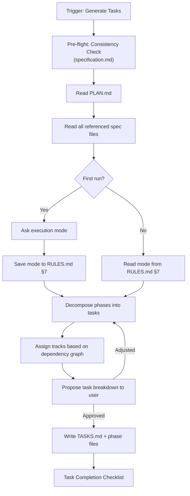
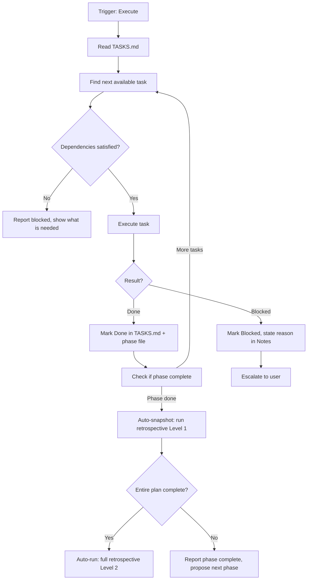
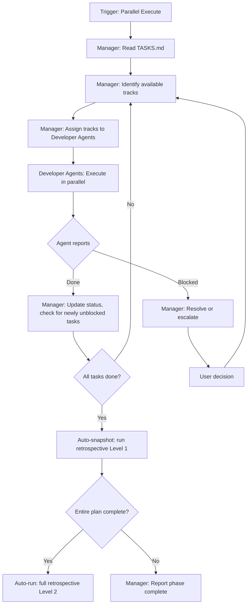

# Task Workflow

This workflow reads `.design/PLAN.md` and decomposes it into atomic, executable tasks.
It operates **after** the Plan Workflow — the plan is its input, not its concern.

> **Scope**: Task generation, execution tracking, parallelism, and agent coordination.
> Specification authoring → Spec Workflow. Planning → Plan Workflow. Execution → this workflow.

## Agent Guidelines

**CRITICAL INSTRUCTIONS FOR AI:**

1. **Plan First**: Never generate tasks without reading `.design/PLAN.md`. Tasks are derived from the plan — they do not invent scope.
2. **Auto-Init**: If `.design/` or its system files are missing, automatically trigger the Init pre-flight check (`.magic/init.md`) before proceeding.
3. **Atomic Tasks**: Each task must map to exactly one section of one spec file. A task that touches two specs is two tasks.
4. **Dependency Respect**: Never mark a task as available if its declared dependencies are not `Done`.
5. **Mode Awareness**: Always know the current execution mode (Sequential or Parallel). Behaviour differs significantly between them.
6. **Manager Role**: In Parallel mode, the Manager Agent coordinates — it does not implement. It reads status, unblocks tracks, and escalates conflicts.
7. **Checklist Before Done**: Every workflow operation must end with the *Task Completion Checklist*.

## Directory Structure

```plaintext
.design/
├── INDEX.md
├── RULES.md
├── PLAN.md # Input: implementation plan
├── specifications/
└── tasks/ # Output: task files
    ├── TASKS.md # Master index: all tasks, all phases, all statuses
    └── phase-{n}.md # Per-phase task breakdown with tracks
```

## Task Anatomy

Every task has a fixed structure:

```
[T-{phase}{track}{seq}] {Title}
  Spec:     {spec-name}.md §{section}
  Phase:    {n} / Track {A|B|C...}
  Depends:  {T-ID, T-ID, ... | —}
  Status:   {Todo | In Progress | Done | Blocked}
  Assignee: {Developer-A | Developer-B | ... | unassigned}
  Notes:    {optional}
```

**ID format**: `T-1A01` = Phase 1, Track A, task 01.

**Status rules:**

- `Todo` — not yet started; dependencies may or may not be satisfied
- `In Progress` — actively being worked on
- `Done` — implementation complete, output verified
- `Blocked` — cannot proceed; blocking reason must be stated in Notes

## Execution Tracks

Within each phase, tasks are grouped into **Execution Tracks**. Tasks in different tracks are independent and can run in parallel. Tasks within the same track run sequentially.

```
Phase 2
  Track A: [T-2A01] → [T-2A02] → [T-2A03]   ══╗
                                               ║ (parallel)
  Track B: [T-2B01] → [T-2B02]               ══╣
                                               ║
  Track C: [T-2C01]  (depends on A + B)      ══╝ (after A and B complete)
```

Track assignment is derived from the dependency graph in PLAN.md — specs that don't depend on each other can be different tracks.

## Execution Modes

### Sequential Mode

One agent works through tasks in track order, phase by phase. Default mode for solo development or single-agent setups.

```
Manager Agent: reads TASKS.md, picks next available task, executes, updates status, repeats.
```

### Parallel Mode

Multiple Developer Agents work simultaneously, each owning one track. A Manager Agent coordinates.

```
Manager Agent:     reads TASKS.md → assigns tracks → monitors → unblocks → escalates
Developer Agent A: owns Track A → executes T-xA01, T-xA02... → reports Done/Blocked
Developer Agent B: owns Track B → executes T-xB01, T-xB02... → reports Done/Blocked
```

The execution mode is stored in `RULES.md §7` as a Project Convention and does not need to be re-asked on subsequent runs.

## Workflow Steps

### Initializing Tasks

Use when `.design/tasks/TASKS.md` does not exist.

**Trigger phrase**: *"Generate tasks"* or *"Create tasks"*



0. **Consistency Check**: Before reading the plan, run the *Consistency Check (Pre-flight)* from `specification.md`. This verifies that specs match the actual project state. If issues are found — fix them first. Do not generate tasks based on stale specs.
1. **Read PLAN.md**: Get phases, specs per phase, dependency graph, and critical path.
2. **Read spec files**: For each spec in PLAN.md, read its `Implementation Notes` (§4) if present — these directly inform task decomposition.
3. **Ask execution mode** (first run only):

    ```
    How should tasks be executed?

      A) Sequential — one agent works through tasks in order (default)
      B) Parallel   — Manager Agent + Developer Agents per track

    This choice will be saved to RULES.md §7 and used for all future runs.
    You can change it at any time with: "Switch to parallel mode"
    ```

4. **Decompose**: For each spec in each phase, extract atomic tasks from:
    - Numbered sections in `Detailed Design`
    - Steps listed in `Implementation Notes`
    - Logical units implied by the spec's structure

    One spec section = one task (or a few if the section is large). Never bundle multiple specs into one task.

5. **Assign tracks**: Group tasks into tracks based on independence:
    - Tasks with no shared dependencies → separate tracks (can run in parallel)
    - Tasks that depend on the same prerequisite → may share a track or be sequenced

6. **Propose breakdown**: Show the user the full task structure before writing:

    ```
    Proposed Task Breakdown — Phase 1

    Execution mode: Sequential

    Track A — Core Layer
      [T-1A01] Define AppState FSM structure
               Spec: architecture.md §3.1
               Depends: —

      [T-1A02] Implement Path Reliability (current_exe)
               Spec: architecture.md §3.2
               Depends: T-1A01

    Track B — API Contract (parallel with A)
      [T-1B01] Define LaunchpadBuilder interface
               Spec: api.md §2.1
               Depends: —

    Track C — Settings Schema (after A)
      [T-1C01] Define RON schema root structure
               Spec: settings-schema.md §1.1
               Depends: T-1A01

      [T-1C02] Define Graphics and Audio blocks
               Spec: settings-schema.md §2.1, §2.2
               Depends: T-1C01

    Total: 5 tasks, 3 tracks
    Parallelisable at start: Track A and Track B simultaneously

    Proceed? (yes / adjust)
    ```

7. **Write files**: Create `TASKS.md` (master index) and `phase-1.md`, `phase-2.md`... using the templates below.
8. **Task Completion Checklist**: Present the checklist.

### Executing Tasks (Sequential Mode)

**Trigger phrase**: *"Start tasks"*, *"Next task"*, *"Continue"*



1. **Find next available task**: The task with status `Todo` whose all dependencies are `Done`. In sequential mode: pick the first one in track order.
2. **Execute**: Perform the implementation work described by the task. Stay within the task's spec section — do not expand scope.
3. **Update status**: Mark `In Progress` when starting, `Done` when complete, `Blocked` if a blocker is encountered.
4. **Report**: After each task, briefly state what was done and what is next.
5. **On phase completion**:
    - Run **retrospective Level 1 (auto-snapshot)**: read INDEX.md, TASKS.md, RULES.md → count stats → append one row to `.design/RETROSPECTIVE.md` Snapshots table. Do this **silently** — no user confirmation needed.
    - Check if the **entire plan** is complete (all phases, all tasks Done). If yes → auto-run **retrospective Level 2 (full)** as the final step.
    - If not done → report phase complete and propose the next phase.

### Executing Tasks (Parallel Mode)

**Trigger phrase**: *"Start parallel execution"*, *"Launch agents"*



#### Manager Agent Responsibilities

The Manager Agent does not write implementation code. Its job is coordination:

- **At start of phase**: Read TASKS.md, identify all `Todo` tasks whose dependencies are satisfied, assign each available track to a Developer Agent.
- **On task completion**: Update task status to `Done`, recalculate which tasks are now unblocked, assign newly available tasks.
- **On blocking**: Read the blocker reason, determine if it can be resolved (missing spec detail → consult spec file, dependency not done → reorder), escalate to user if not resolvable.
- **On conflict**: If two Developer Agents need to modify the same file simultaneously, Manager serializes access — one waits while the other finishes.
- **Status report**: After each round of completions, show a compact summary:

    ```
    Phase 2 Status — {timestamp}

    Track A: [T-2A01] Done ✓  [T-2A02] In Progress...
    Track B: [T-2B01] Done ✓  [T-2B02] Done ✓
    Track C: [T-2C01] Blocked — waiting for T-2A02

    Newly unblocked: none
    Active agents: Developer-A (T-2A02)
    ```

#### Developer Agent Responsibilities

Each Developer Agent owns one track for the duration of a phase:

- Execute tasks in track order, one at a time.
- Report `Done` to Manager when complete, `Blocked` with reason when stuck.
- Do not touch files outside the assigned track's scope without Manager approval.
- Do not start the next task until the current one is `Done`.

### Updating Tasks

**Trigger phrase**: *"Update tasks"*, *"Sync tasks"*

Use when specs or the plan have changed after tasks were generated.

1. Read current `TASKS.md` and compare against `PLAN.md`.
2. Detect changes:
    - New spec added to plan → propose new tasks for that spec
    - Spec updated (new section) → propose additional task
    - Spec deprecated → mark related tasks as `Cancelled` in TASKS.md
3. Show diff to user before writing:

    ```
    Task sync detected changes:

    + New tasks proposed (gameplay-config.md added to Phase 4):
      [T-4A01] Implement gameplay.ron deserialization
      [T-4A02] Implement hot-reload event (GameplayConfigChanged)

    ~ Modified tasks (architecture.md §3.2 updated):
      [T-1A02] "Implement Path Reliability" — spec section updated
      → Recommend: re-verify if task is still accurate

    Apply? (yes / select / skip)
    ```

### Task Completion Checklist

**Must be shown at the end of every task workflow operation.**

```
Task Workflow Checklist — {operation description}

Input Integrity
  ☐ PLAN.md was read before any tasks were generated or modified
  ☐ All task-to-spec mappings reference real sections in real spec files

Task Structure
  ☐ Each task maps to exactly one spec section (no cross-spec bundling)
  ☐ All task IDs follow the T-{phase}{track}{seq} format
  ☐ All dependencies declared explicitly (or marked —)

Track Integrity
  ☐ Tasks in different tracks have no hidden shared dependencies
  ☐ Track C (or later) tasks correctly depend on earlier track completions
  ☐ No circular dependencies between tasks

Execution Mode
  ☐ Execution mode recorded in RULES.md §7
  ☐ In Parallel mode: Manager Agent role is clearly defined
  ☐ In Parallel mode: no two agents assigned to the same file simultaneously

Status
  ☐ TASKS.md updated to reflect current state
  ☐ Per-phase files updated to match TASKS.md
  ☐ All Blocked tasks have a reason stated in Notes
```

## Templates

### TASKS.md — Master Index

```markdown
# Task Index

**Version:** {X.Y.Z}
**Generated:** {YYYY-MM-DD}
**Based on:** .design/PLAN.md v{X.Y.Z}
**Execution Mode:** {Sequential | Parallel}
**Status:** Active

## Overview

Master index of all implementation tasks. Detailed breakdowns: see `phase-{n}.md` files.

## Summary

| Phase | Total | Todo | In Progress | Done | Blocked |
| :---- | ----: | ---: | ----------: | ---: | ------: |
| Phase 1 — Foundation | 5 | 3 | 1 | 1 | 0 |
| Phase 2 — Services & Data | 8 | 8 | 0 | 0 | 0 |
| **Total** | **13** | **11** | **1** | **1** | **0** |

## Phase 1 — Foundation

See [phase-1.md](phase-1.md) for full breakdown.

| ID | Title | Track | Status |
| :- | :---- | :---- | :----- |
| T-1A01 | Define AppState FSM structure | A | Done ✓ |
| T-1A02 | Implement Path Reliability | A | In Progress |
| T-1B01 | Define LaunchpadBuilder interface | B | Todo |
| T-1C01 | Define RON schema root structure | C | Todo |

## Phase 2 — Services & Data

See [phase-2.md](phase-2.md) for full breakdown.

| ID | Title | Track | Status |
| :- | :---- | :---- | :----- |
| T-2A01 | Implement Asset Manifest loader | A | Todo |

## Archived / Cancelled

| ID | Title | Reason |
| :- | :---- | :----- |
<!-- Tasks cancelled due to spec deprecation appear here -->

## Task History

| Version | Date | Author | Description |
| :--- | :--- | :--- | :--- |
| 1.0.0 | YYYY-MM-DD | Agent | Initial task generation |
```

### phase-{n}.md — Per-Phase Task File

```markdown
# Phase {N} — {Phase Name}

**Status:** {Active | Completed}
**Execution Mode:** {Sequential | Parallel}
**Tracks:** {A, B, C...}

## Track A — {Track Name}

### [T-{N}A01] {Task Title}

- **Spec:** [{spec-name}.md](../specifications/{spec-name}.md) §{section}
- **Depends:** —
- **Status:** Todo
- **Assignee:** unassigned
- **Notes:** —

### [T-{N}A02] {Task Title}

- **Spec:** [{spec-name}.md](../specifications/{spec-name}.md) §{section}
- **Depends:** T-{N}A01
- **Status:** Todo
- **Assignee:** unassigned
- **Notes:** —

## Track B — {Track Name} *(parallel with A)*

### [T-{N}B01] {Task Title}

- **Spec:** [{spec-name}.md](../specifications/{spec-name}.md) §{section}
- **Depends:** —
- **Status:** Todo
- **Assignee:** unassigned
- **Notes:** —

## Track C — {Track Name} *(after A + B)*

### [T-{N}C01] {Task Title}

- **Spec:** [{spec-name}.md](../specifications/{spec-name}.md) §{section}
- **Depends:** T-{N}A02, T-{N}B01
- **Status:** Todo
- **Assignee:** unassigned
- **Notes:** —

## Phase Completion

- [ ] All tasks Done
- [ ] No open blockers
- [ ] TASKS.md summary updated
- [ ] Retrospective auto-snapshot appended to RETROSPECTIVE.md
- [ ] Next phase unlocked: Phase {N+1}
- [ ] If all phases complete: full retrospective (Level 2) was run
```
