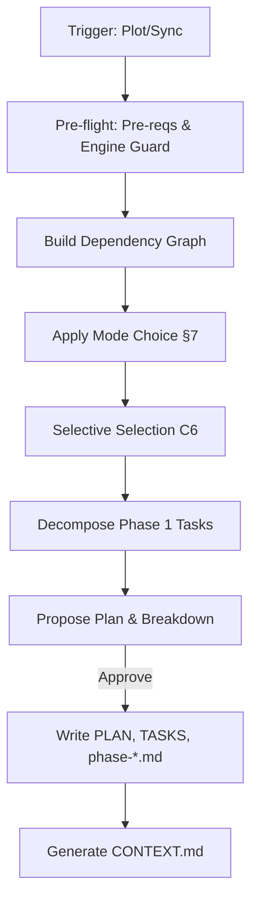

# Task Workflow

Generates `PLAN.md` (Phases) and `TASKS.md` (Atomic Tasks). Input: `.design/specifications/`.

## Core Invariants (Mandatory)

1. **Context (Zero-Prompt)**: Auto-resolve workspace via `.design/workspace.json`. Route all logic to `.design/{workspace}/`. Never ask.
2. **Registry Integrity**: Read ALL specs in `INDEX.md` before planning. No exceptions.
3. **Auto-Init**: If `.design/` missing, auto-run `.magic/init.md`.
4. **Logic Guards**:
    - **No Orphans**: Every registered spec must be in `PLAN.md` or `## Backlog`.
    - **Atomic Tasks (C10)**: 1 task = 1 spec section. Use `[ ]`, `[/]`, `[x]`, `[~]`, `[!]`.
    - **User Gate**: Show phase structure and task breakdown BEFORE writing files.
    - **Zero-Prompt handoff**: After approval, authorize skip-confirm for `magic.run`.
5. **Architectural Logic**:
    - **Circular Guard**: If cycles (A→B→A) found → **HALT**.
    - **Layer Respect**: L1 (Concept) always scheduled BEFORE L2 (Implementation).
    - **Selective Planning (C6)**: `Draft` → Backlog. `RFC` → Recommend Backlog. `Stable` → Propose for Plan.

---

## Workflow: Planning & Orchestration


```mermaid
graph TD
    A[Trigger: Plot/Sync] --> B[Pre-flight: Pre-reqs & Engine Guard]
    B --> C[Build Dependency Graph]
    C --> D[Apply Mode Choice §7]
    D --> E[Selective Selection C6]
    E --> F[Decompose Phase 1 Tasks]
    F --> G[Propose Plan & Breakdown]
    G -->|Approve| H[Write PLAN, TASKS, phase-*.md]
    H --> I[Generate CONTEXT.md]
```

### Steps

1. **Pre-flight**: `node .magic/scripts/executor.js check-prerequisites --json --require-specs`.
    - `checksums_mismatch` → **HALT**. Restore engine first.
2. **Analyze**: Extract `Related Specifications` and `Implementation Notes`.
3. **Draft Plan**: Group by Layer. Check for cycles.
4. **Execution Mode**: If not in `RULES.md §7`, ask (Sequential/Parallel) and save to §7.
5. **Decompose**: Split Phase 1 into 2-3 tasks per spec.
    - **IDs**: `T-{phase}{track}{seq}` (e.g., `T-1A01`).
    - **Tracks**: Group tasks by file independence.
6. **Sync (Update Mode)**:
    - **C12 Quarantine**: If L1 parent drops `Stable` → Move L2 children to Backlog; mark tasks `Blocked [!]`.
    - **Phantom Specs**: If spec in PLAN but missing in INDEX → Cancel `Todo`; archive `Done`.
    - **Renames**: Global search-and-replace on filename changes (exclude archives).

### Plan Write-back

- Use `.magic/templates/plan.md` and `.magic/templates/tasks.md`.
- PLAN.md: Summarize, don't copy.
- TASKS.md: Master index with `Based on RULES:` version.

---

## Task Completion Checklist

```
Task Workflow Checklist — {operation}
  ☐ All registered specs read; no orphans/phantoms left unaddressed
  ☐ Circular dependencies checked; layer order 1->2 respected
  ☐ Selective Planning (C6) and Quarantine (C12) applied
  ☐ Execution mode saved to RULES.md §7; Task IDs valid
  ☐ PLAN.md / TASKS.md written; CONTEXT.md regenerated
```
