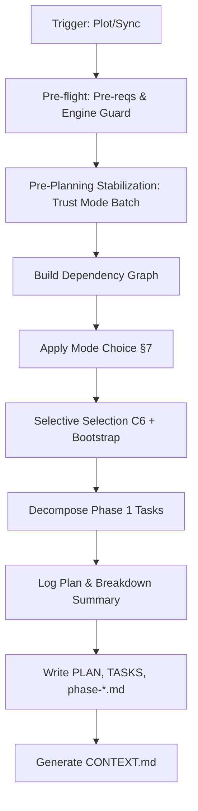

# Task Workflow

Generates `PLAN.md` (Phases) and `TASKS.md` (Atomic Tasks). Input: `.design/specifications/`.

## Context Quality Guidance

The agent adapts operation depth based on context window utilization:

| Tier | Context Used | Behaviour |
| --- | --- | --- |
| **PEAK** | 0–30% | Full reads: complete specs, full TASKS.md, full STATE.md |
| **GOOD** | 30–50% | Normal operation; prefer summaries over full-file reads |
| **DEGRADING** | 50–70% | Read only relevant spec §sections; use frontmatter summaries |
| **POOR** | 70%+ | Read STATE.md + phase frontmatter only; skip full spec reads |

> At DEGRADING/POOR tier: prioritize STATE.md `Next Action` and phase `provides` fields over broad file scans. Trigger `/magic.pause` if POOR tier reached mid-phase.

## Argument Routing

Parse `[arg]` to determine planning mode:

| Input | Detection | Result |
| --- | --- | --- |
| *(empty)* | No argument | **Full Planning**: resolve workspace via §Workspace Resolution, then plan all specs |
| `engine` | Matches a workspace name in `workspace.json` | **Scoped Planning**: plan only specs registered in that workspace's `INDEX.md` |
| `"decompose phase-2"` | Quoted text or text that does NOT match any workspace name | **Guided Planning**: interpret text as planning directive (focus, instruction, filter) |
| `engine "only new specs"` | First token is workspace + remaining is quoted text | **Scoped + Guided**: planning directive applied within workspace scope |

> **Workspace Fallback (Modes A, C)**: when no workspace specified, resolve via Core Invariant #1 (Zero-Prompt chain) before applying the planning directive. The directive text filters or guides planning but does not replace workspace resolution.
> **Disambiguation**: a single unquoted word that matches both a workspace name and a directive keyword → workspace takes priority. Force directive interpretation by quoting: `/magic.task "engine"`.
> **Handoff Propagation**: when recommending `/magic.run` after planning, propagate the workspace context: `/magic.run {workspace}`.

## Core Invariants (Mandatory)

1. **Context (Zero-Prompt)**: Apply the workspace resolution chain from [context.md](context.md) (Priority 1-4, Disambiguation, Scope Auto-Apply).
2. **Registry Integrity**: Read ALL specs in `INDEX.md` before planning. No exceptions.
3. **Auto-Init**: If `.design/` or system files missing, silently execute `.magic/init.md` (do not prompt user).
   - **Intent Preservation**: if `init.md` or `analyze.md` is sub-delegated during this workflow, memo the original user intent before delegating. After delegation resolves, resume explicitly: *"Resuming: '{original intent}'."* Intent MUST NOT be silently dropped across workflow boundaries.
4. **Logic Guards**:
   - **No Orphans**: every registered spec must be in `PLAN.md` or `## Backlog`.
   - **Atomic Tasks (C10)**: every spec in Phase 1+ must have a concise checklist in **`TASKS.md`** (Phase Checklist) with `T-XXXX` IDs.
   - **Auto-Plan (C9 default)**: automatically generate and write the Plan & Checklist without prompting. Narrate inline as the work happens — e.g., `[Auto-Plan] Phase 2: {N} specs → {short list}. (Adjust: /magic.task amend | Revert: git restore .design/{ws}/PLAN.md)`. No "Go" confirm; no menu.
   - **Zero-Prompt handoff**: after writing tasks, hand off to execution mode if applicable (subject to wrapper constraints).
5. **Rules Parity**: Record current `RULES.md` version in `TASKS.md` header. Notify user of drift and re-sync during update.
6. **Engine Integrity (C14)**: If `.magic/` modified → `node .magic/scripts/executor.js update-engine-meta`.
7. **Architectural Logic**:
   - **Circular Guard (Semantic Split)**:
     - **Hard Dependencies** (`Implements:` chains, L2→L1): deep-scan across ALL levels. Any cycle → **HALT**. These are blocking dependencies that define build/planning order.
     - **Soft References** (`Related Specifications`): scan for mutual references. Cycles here are **warnings**, not HALTs — peer modules in the same layer commonly cross-reference each other (e.g., ECS core systems, networking subsystem). Log: `[Cycle-Info] {N} mutual references detected in Related Specifications (non-blocking).`
   - **Cycle Resolution** (Hard Dependencies only): suggest breaking the chain by identifying the "weakest link" — the edge that should be downgraded from `Implements` to `Related Specifications`.
   - **Layer Respect**: L1 (Concept) always scheduled BEFORE L2 (Implementation).
   - **Autonomous Selection (C6)**: **Default**: auto-pull ALL `Stable` specs into the active `PLAN.md`. Move `Draft`/`RFC` to `## Backlog`. No user prompt unless a priority conflict is detected.
   - **C6 Bootstrap Exception**: if, after Pre-Planning Stabilization (Step 2), **zero** specs reached `Stable` AND the project has **no prior `PLAN.md`** (file missing or contains zero active phase entries) → activate Bootstrap Mode. In Bootstrap Mode, `Draft` specs that pass MVC criteria (Overview + at least one design section) are treated as plannable with a `[Bootstrap]` marker. The generated plan is explicitly tentative: `[Bootstrap Plan] {N} Draft specs planned tentatively. Plan will be finalized when specs reach Stable.` Bootstrap Mode is automatically deactivated once ≥1 spec reaches `Stable` through normal lifecycle.
   - **Actionable Outcome**: after planning, show: `[Auto-Plan] {N} specs added to Phase {X}, {M} moved to Backlog.`
   - **Parent Header Parity (Cross-Workspace)**: when planning an L2 spec that implements an L1 parent in a DIFFERENT workspace, the agent MUST verify the parent's file header against its own workspace's `INDEX.md`. Drift (`STATUS_DRIFT`/`VERSION_DRIFT`) in the cross-workspace parent → **HALT**. Ensures L2 tasks are never planned against mismatched L1 definitions.

## Workflow: Planning & Orchestration


```mermaid
graph TD
    A[Trigger: Plot/Sync] --> B[Pre-flight: Pre-reqs & Engine Guard]
    B --> S[Pre-Planning Stabilization: Trust Mode Batch]
    S --> C[Build Dependency Graph]
    C --> D[Apply Mode Choice §7]
    D --> E[Selective Selection C6 + Bootstrap]
    E --> F[Decompose Phase 1 Tasks]
    F --> G[Log Plan & Breakdown Summary]
    G --> H[Write PLAN, TASKS, phase-*.md]
    H --> I[Generate CONTEXT.md]
```

### Steps

1. **Pre-flight**: `node .magic/scripts/executor.js check-prerequisites --json --require-specs --verify-headers --workspace {active-workspace}`.
   - **C15 Filter**: `checksums_mismatch` or `GHOST_REGISTRY` → C15 Filter (`init.md §1`). In-scope → **HALT**. Out-of-scope → proceed silently.
   - **File-Header Parity**: for each spec in `INDEX.md`, read the actual file's `Status:` and `Version:` header fields. Either mismatches the corresponding `INDEX.md` entry → **HALT** with `STATUS_DRIFT` or `VERSION_DRIFT`. Report: *"Header parity failure on `{file}`: file {field} `{file_val}` ≠ registry `{index_val}`. Run `/magic.spec` to reconcile spec headers, then re-run `/magic.task`."* Catches manual edits that bypassed the spec workflow.
   - **Cross-Workspace Parity**: if `workspace.json` registers >1 workspace, scan for identically-named spec files across workspaces. Any name collision with version mismatch → **HALT**. Report: *"Source of Truth Drift: `{file}` exists in `{ws-a}` (v{X}) and `{ws-b}` (v{Y}). Run `/magic.spec` in `{ws-a}` (higher version) to reconcile, then re-run `/magic.task`."* One recommended path — no option menu.
   - **Cross-Workspace Parent Header Parity** (Pre-flight gate): for every L2 spec in the active workspace whose `Implements:` field references an L1 spec in a **different** workspace, read that parent's file header (`Status:`, `Version:`) and compare against the parent workspace's own `INDEX.md` entry. Mismatch → **HALT** with `STATUS_DRIFT` or `VERSION_DRIFT`. Report: *"Cross-workspace parent drift: `{parent-file}` in `{parent-ws}` — file header `{field}: {file_val}` ≠ registry `{index_val}`. Run `/magic.spec` in `{parent-ws}` to reconcile, then re-run `/magic.task`."* Runs in Pre-flight (Step 1) — not deferred to Step 7 — to prevent planning against a drifted L1 parent before any artifacts are written.
   - **T4 Queue (Cross-Workflow)**: if the planning-directive argument contains a T4 trigger phrase (`"remember that..."`, `"from now on..."`, `"project rule:"`) AND any Pre-flight gate above HALTs, acknowledge the embedded T4 explicitly: *"T4 rule detected — queued pending {drift_type} resolution. Will be applied via `spec.md` T4 Inline Guards after resolution."* Do NOT write to `RULES.md` until Pre-flight passes on a subsequent invocation. Mirrors `spec.md §Updating → T4 Queue` semantics so a T4 phrase routed through `magic.task` is never silently dropped.
2. **Pre-Planning Stabilization (Trust Mode Batch)**:
   - Iterate all `Draft` specs registered in `INDEX.md`, processing **L1 specs first**, then **L2 specs** (layer order is mandatory — an L2 spec cannot promote until its L1 parent is `Stable`). **Workspace order**: when multiple workspaces exist, process the `default` workspace first (per `workspace.json`), then remaining workspaces in registration order. Ensures foundational specs are promoted before consumer workspaces that depend on them.
   - For each spec, evaluate Trust Mode criteria from `spec.md`:
     - (a) No `RULES.md` conflicts.
     - (b) No hard-dependency cycles (per Circular Guard Semantic Split — soft reference cycles do NOT block promotion).
     - (c) Layer constraints satisfied (`Implements:` field present and valid for L2).
     - (d) **Minimum Viable Completeness (MVC)**: `Overview` + at least one design section (`Core Invariants` for L1, `Invariant Compliance` for L2, `Detailed Design`, or for non-standard layers like `test`/`tool` — any numbered section with substantive content). Full template compliance NOT required for Draft→Stable batch promotion — missing optional sections (`Drawbacks`, `Implementation Notes`) do not block.
   - **Promote**: specs passing all criteria → promoted `Draft → Stable`. Update both file headers and `INDEX.md` entries atomically.
   - **Skip**: specs failing any criterion remain `Draft` with a logged reason.
   - Report: `[Pre-Plan] {N} specs promoted to Stable, {M} remain Draft. Reasons: {summary}.`
   - **Field Normalization**: during iteration, if an L2 spec uses a non-standard field name for its L1 parent reference (e.g., `L1 Reference:` instead of `Implements:`), auto-rename to canonical `Implements:`. Log: `[Normalize] {file}: 'L1 Reference' → 'Implements'.`
3. **Analyze**: extract `Related Specifications` and `Implementation Notes`.
4. **Draft Plan**: group by Layer. Build full dependency matrix *before* task generation to detect N-level cycles.
5. **Planning Audit**: activate `@role:planner` to review the draft `PLAN.md`. Audit for:
   - **Optimism Bias**: have task sizes been underestimated?
   - **Hidden Dependencies**: are parallel tracks truly independent, or is there a shared resource/config bottleneck?
   - **Cascade Risk**: if a critical spec fails to implement in Phase 1, how many Phase 2 tasks are instantly blocked?
6. **Execution Mode**: default to **Parallel mode (C3)**. If mode is not defined in `RULES.md §7`, assume Parallel (do not ask).
7. **Decompose**: split the active phase into 2-3 tasks per spec.
   - **IDs**: `T-{phase}{track}{seq}` (e.g., `T-1A01`).
   - **Tracks**: group tasks by file independence.
   - **Verify Line (Mandatory)**: every atomic task MUST include a `Verify` line with a concrete command, check, or evidence source. Vague criteria such as "works", "verify manually", or "covered by tests" are invalid unless the specific test/check is named.
   - **Testing (Mandatory)**: every feature track MUST include at least one `Validation Task` (e.g., `T-1T01`) to verify implementation vs spec.
8. **Sync (Update Mode)**:
   - **C12 Quarantine**: if L1 parent is not `Stable` in `INDEX.md` (status already changed by `spec.md` C12 cascade) → move L2 children to `## Backlog` in `PLAN.md`; mark their tasks `Blocked [!]` with reason: *"L1 parent `{file}` is `{status}` (C12)"*. **Cross-Workspace C12**: if the L1 parent resides in a different workspace, verify its status by reading that parent workspace's `INDEX.md`. **Do NOT modify INDEX.md** — status changes are the responsibility of `spec.md` only. **C12.1 Stabilization Exception**: tasks intended to stabilize or fix mismatches to regain `Stable` status may bypass quarantine.
   - **Phantom Specs**: spec in PLAN/INDEX but missing from disk → cancel `Todo`/`Pending`; archive `Done`. Block active tasks.
   - **Phantom Parent Guard**: L2 spec's parent missing from disk or `INDEX.md` (cross-workspace or local) → **HALT**. Report: *"Parent Spec `{parent-file}` (L1) is missing. Cannot plan dependent `{file}` (L2). Run `/magic.spec` to author the missing parent, then re-run `/magic.task`."* Move L2 to `## Backlog` with reason: *"Missing L1 Parent (Phantom)."*
   - **Structural Refactor**: if sections merged or split, validate all `T-{ID}` mappings to §sections. Re-map in TASKS.md & phase files. **ID Splitting**: keep original `T-{ID}` for the first sub-task; append `.N` suffixes (e.g., `T-1A01.1`, `T-1A01.2`) for others.
   - **Renames**: global search-and-replace on filename changes (exclude archives). Ensure new names follow the `l1-`/`l2-` prefix convention.

### Plan Write-back

- Use `.magic/templates/plan.md`, `.magic/templates/tasks.md`, and `.magic/templates/phase.md`.
- PLAN.md: strategic overview (Phases & Specifications). No atomic checklist items.
- TASKS.md: master Phase Index. Contains phase registry and status tracking.
- tasks/phase-{n}.md: tactical execution workbooks. Contain atomic checklists (T-XXXX) for specific phases.
- **Phase Frontmatter**: when creating `tasks/phase-{N}.md`, populate the YAML frontmatter from the draft PLAN.md. At minimum fill: `phase`, `name`, `status: Todo`, `subsystem` (inferred from touched directories/specs), `requires` (from dependency graph built in Step 3). Leave `provides`, `key_files`, `patterns_established`, `duration_minutes` empty — filled by `run.md` on phase completion.
- **Dependency Read**: when building the dependency matrix (Step 3), also read existing `phase-*.md` frontmatter `provides` fields to understand what prior phases deliver. Supplements PLAN.md prose descriptions with machine-readable data.

### State Init/Update

After PLAN.md, TASKS.md, and phase files are written:

- If `STATE.md` does not exist → it will be created by `init.md` automatically (always called first).
- Update STATE.md to reflect new plan:
  `node .magic/scripts/executor.js update-state --workspace={active-workspace-dir} --phase="1 — {Phase-1 Name}" --status=Active --next-action="Run /magic.run to execute Phase 1"`
- If plan update mode (C12, update, sync) → patch `--phase` and `--next-action` to reflect the re-planned state.

### Context Regeneration

After writing PLAN.md, TASKS.md, and phase files, regenerate the workspace context file:
`node .magic/scripts/executor.js generate-context --workspace {active-workspace}`

### Graph Refresh (Post-Write)

Per [`l2-spec-graph-memory.md` §4.4](../.design/engine/specifications/l2-spec-graph-memory.md#44-workflow-integration-triggers), `PLAN.md` phases are graph nodes. After Plan Write-back and Context Regeneration, run **once per planning invocation**:

```bash
node .magic/scripts/executor.js export-wiki
```

Best-effort — log `[Graph-Refresh] export-wiki failed: {err}. Wiki may be stale.` on failure and continue. Skip in pure dependency-graph audit mode (no plan written).

**Read-side tip (planning)**: before building the dependency matrix in Step 3, prefer reading `.design/wiki/index.md` and per-spec wiki articles over scanning every raw spec file. The wiki gives layer/status/version/refs at ~10× lower token cost than full spec reads. Fall back to direct `.design/specifications/` reads only when wiki is absent or `WIKI_STALE` was reported by the most recent `analyze` Mode C run.

## Finalization Protocol (Mandatory)

After all workflow steps (incl. Context Regeneration + Graph Refresh) and **before** the Completion Checklist:

1. Run `node .magic/scripts/executor.js finalize --workflow=task`. Output is either `✅ Finalization complete` (with version bump + CHANGELOG entry + suggested commit message) or `⏭️ No significant changes detected`.
2. **Display the entire script output verbatim** in a fenced block.
3. **Hard rule**: do NOT invoke `git commit`, `git add`, or any write-side git command — the user reviews the suggested message and commits manually.
4. Script exit non-zero → emit WARNING, do NOT block the Completion Checklist.

**Opt-out**: `MAGIC_FINALIZE=0` env var, or `finalization.enabled = false` in `.design/workspace.json`.

## Task Completion Checklist

```
Task Workflow Checklist — {operation}
  ☐ All registered specs read; no orphans/phantoms left unaddressed
  ☐ Pre-Planning Stabilization: Trust Mode batch applied (L1→L2 order); field normalization done
  ☐ Circular Guard: hard-dependency cycles checked (Implements chains); soft reference cycles logged
  ☐ Selective Planning (C6) and Quarantine (C12) applied; Bootstrap Exception evaluated if needed
  ☐ Verify Lines: Every atomic task has a concrete command/check/evidence criterion
  ☐ Testing Track: Validation tasks (T-XXXX) included for all new features
  ☐ Rules Parity: Current RULES.md version recorded in TASKS.md; Task IDs valid
  ☐ Planning Audit: Draft Plan reviewed by `@role:planner` (Optimism, Dependencies, Risk)
  ☐ Phase Frontmatter: YAML block populated in phase-*.md files (phase, name, status, subsystem, requires)
  ☐ STATE.md updated with new phase and next action after plan write-back
  ☐ PLAN.md (Strategic) / TASKS.md (Tactical) written; CONTEXT.md regenerated
  ☐ Graph: export-wiki run after plan write-back (skip if no plan written)
  ☐ Engine Meta: C14 bump performed if .magic/ files modified
  ☐ Engineer Posture (C25): plan auto-written and narrated; no "Go" prompts
```
