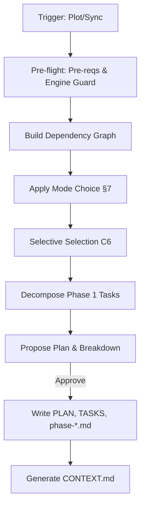

# Task Workflow

Generates `PLAN.md` (Phases) and `TASKS.md` (Atomic Tasks). Input: `.design/specifications/`.

## Core Invariants (Mandatory)

1. **Context (Zero-Prompt)**: Auto-resolve workspace via `.design/workspace.json`. Route all logic to `.design/{workspace}/`. Never ask.
2. **Registry Integrity**: Read ALL specs in `INDEX.md` before planning. No exceptions.
3. **Auto-Init**: If `.design/` missing, auto-run `.magic/init.md`.
4. **Logic Guards**:
    - **No Orphans**: Every registered spec must be in `PLAN.md` or `## Backlog`.
    - **Atomic Tasks (C10)**: 1 task = 1 spec section. Use `[ ]`, `[/]`, `[x]`, `[~]`, `[!]`.
    - **User Gate**: In **Trust Mode**, show a concise summary (Phases & Goals) and ask for a single "Go" confirm. Full details remain in `.design/` for inspection but aren't forced on the user.
    - **Zero-Prompt handoff**: After approval, authorize skip-confirm for `magic.run`.
5. **Rules Parity**: Record current `RULES.md` version in `TASKS.md` header. Notify user of drift and re-sync during update.
6. **Versioning (C14)**: If `.magic/` modified → `node .magic/scripts/executor.js update-engine-meta --workflow task` (Smart History: redundant automated entries are skipped).

7. **Architectural Logic**:
    - **Circular Guard**: Deep scan `Related Specifications` across ALL levels. If ANY cycle (N-level) detected → **HALT**.
    - **Cycle Resolution**: Suggest breaking the chain by identifying the "weakest link" (Related Spec vs Implements).
    - **Layer Respect**: L1 (Concept) always scheduled BEFORE L2 (Implementation).
    - **Autonomous Selection (C6)**: **Default**: Auto-pull ALL `Stable` specs into the active `PLAN.md`. Move `Draft`/`RFC` to `## Backlog`. No user prompt required unless a priority conflict is detected.
    - **Actionable Outcome**: After planning, show: `[Auto-Plan] {N} specs added to Phase {X}, {M} moved to Backlog.`

## Workflow: Planning & Orchestration


```mermaid
graph TD
    A[Trigger: Plot/Sync] --> B[Pre-flight: Pre-reqs & Engine Guard]
    B --> C[Build Dependency Graph]
    C --> D[Apply Mode Choice §7]
    D --> E[Selective Selection C6]
    E --> F[Decompose Phase 1 Tasks]
    F --> G[Propose Plan & Breakdown]
    G -->|Approve| H[Write PLAN, TASKS, phase-*.md]
    H --> I[Generate CONTEXT.md]
```

### Steps

1. **Pre-flight**: `node .magic/scripts/executor.js check-prerequisites --json --require-specs`.
    - `checksums_mismatch` → **HALT**. Restore engine first.
2. **Analyze**: Extract `Related Specifications` and `Implementation Notes`.
3. **Draft Plan**: Group by Layer. Build full dependency matrix *before* task generation to detect N-level cycles.
4. **Execution Mode**: If not in `RULES.md §7`, ask (Sequential/Parallel) and save to §7.
5. **Decompose**: Split Phase 1 into 2-3 tasks per spec.
    - **IDs**: `T-{phase}{track}{seq}` (e.g., `T-1A01`).
    - **Tracks**: Group tasks by file independence.
    - **Testing (Mandatory)**: Every feature track MUST include at least one `Validation Task` (e.g., `T-1T01`) to verify implementation vs spec.
6. **Sync (Update Mode)**:
    - **C12 Quarantine**: If L1 parent drops `Stable` → Move L2 children to Backlog; mark tasks `Blocked [!]` with specific reason. **C12.1 Stabilization Exception**: Tasks intended to stabilize or fix mismatches to regain `Stable` status may bypass quarantine.
    - **Phantom Specs**: If spec in PLAN/INDEX but missing from disk → Cancel `Todo` / `Pending`; archive `Done`. Block active tasks.
    - **Structural Refactor**: If sections merged or split, validate all `T-{ID}` mappings to §sections. Re-map in TASKS.md & phase files. **ID Splitting**: Keep original `T-{ID}` for the first sub-task; append `.N` suffixes (e.g., `T-1A01.1`, `T-1A01.2`) for others.
    - **Renames**: Global search-and-replace on filename changes (exclude archives).

### Plan Write-back

- Use `.magic/templates/plan.md` and `.magic/templates/tasks.md`.
- PLAN.md: Summarize, don't copy.
- TASKS.md: Master index with `Based on RULES:` version.

## Task Completion Checklist

```
Task Workflow Checklist — {operation}
  ☐ All registered specs read; no orphans/phantoms left unaddressed
  ☐ Circular dependencies checked; layer order 1->2 respected
  ☐ Selective Planning (C6) and Quarantine (C12) applied
  ☐ Testing Track: Validation tasks (T-XXXX) included for all new features
  ☐ Rules Parity: Current RULES.md version recorded in TASKS.md; Task IDs valid
  ☐ PLAN.md / TASKS.md written; CONTEXT.md regenerated
  ☐ Engine Meta: C14 bump performed if .magic/ files modified
```
