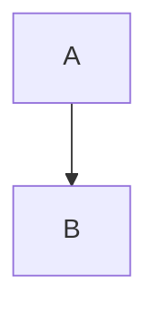

# {Specification Name}

**Version:** {X.Y.Z}
**Status:** {Draft | RFC | Stable | Deprecated}
**Layer:** {concept | implementation}
**Implements:** {layer-1-file.md} <!-- Only if Layer is implementation -->

## Overview

Brief summary of the specification's purpose and scope.

## Related Specifications

- [other-spec.md](other-spec.md) - Dependency or relationship description.

## 1. Motivation

Why is this specification needed? What problems does it solve?

## 2. Constraints & Assumptions

- Hard technical constraints (e.g., "REST only, no GraphQL").
- Key design assumptions (e.g., "single-region deployment for MVP").

## 3. Core Invariants (Layer 1 only)

Rules that Layer 2 implementations MUST NOT violate:

- {Invariant 1: written in technology-agnostic terms}
- {Invariant 2: ...}

> L2 spec cannot reach RFC status until all invariants here are addressed in its "Invariant Compliance" section.

## 4. Invariant Compliance (Layer 2 only)

Explicit mapping of every L1 invariant to this implementation:

| L1 Invariant | Implementation |
| :--- | :--- |
| {invariant} | {how it's done in this stack} |

> This table must be complete before the spec can reach RFC status.
> If an invariant cannot be implemented in this stack — document the conflict here and propose an L1 amendment.

## 5. Detailed Design

### 5.1 Component A

Technical details, logic, and flows.

**Project Structure:**

```plaintext
src/
└── features/
    └── component_a/
```

**Flow Diagram:**



### 5.2 Component B

...

## 6. Implementation Notes

<!-- Optional. Fill if implementation order is non-obvious. -->

1. Step A — prerequisite for all others
2. Step B — can begin after A
3. Step C — parallel with B

## 7. Drawbacks & Alternatives

Potential issues and alternative approaches considered.

## Document History

| Version | Date | Author | Description |
| :--- | :--- | :--- | :--- |
| 0.1.0 | YYYY-MM-DD | User | Initial Draft |
