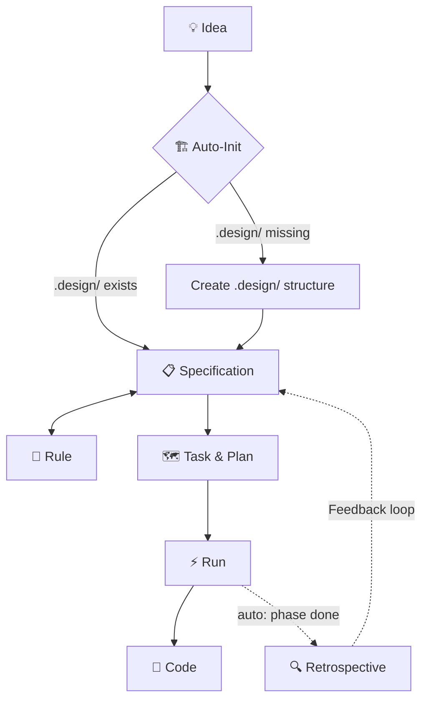

# 🪄 Magic Spec

[](https://www.npmjs.com/package/magic-spec)
[](https://pypi.org/project/magic-spec/)
[](./LICENSE)

**Specification-Driven Development (SDD) workflow for AI coding agents.**

Stop your AI from writing code before it understands the problem.  
`magic-spec` installs a structured pipeline — *Thought → Spec → Plan → Task → Code* — directly into any project, regardless of stack.

## ✨ What is Magic Spec?

`magic-spec` is a set of **markdown-based workflow instructions** for AI coding agents (Cursor, Claude, Gemini, Copilot, etc.). It acts as an operating system for agentic development, enforcing a rigorous, structured pipeline:

```
💡 Idea  →  📋 Specification  →  🗺️ Plan  →  ⚡ Task  →  🚀 Code
```

Once installed, your AI agent will automatically:

- Convert raw thoughts into structured specification files.
- Build a phased implementation plan from approved specs.
- Decompose the plan into atomic, trackable tasks.
- Analyze its own workflow and suggest improvements — automatically, at phase completion.

**No code is written until a specification exists. No spec is implemented without a plan.**

## 🚀 Quick Start

Works with **any project** — Rust, Go, Python, JavaScript, or anything else.  
No runtime lock-in. Requires only Node.js *or* Python to install.

### Option A — Node.js (npx)

```bash
npx magic-spec@latest
```

### Option B — Python (uvx)

```bash
uvx magic-spec
```

Both commands do exactly the same thing:

1. Copy `.magic/` (the SDD engine) into your project.
2. Copy `.agent/workflows/magic.*.md` (agent trigger wrappers) into your project.
3. Run the init script — creates your `.design/` workspace with `INDEX.md` and `RULES.md`.

## 🧭 Core Philosophy

| Principle | Description |
| :--- | :--- |
| **Specs First, Code Later** | The agent is forbidden from writing code from raw input. All ideas become specs first. |
| **Deterministic Process** | A strict pipeline is enforced: *Thought → Spec → Plan → Task → Code*. |
| **Constitution-Driven** | All project decisions live in `.design/RULES.md` — the project's living constitution. |
| **Self-Improving** | After each phase and at plan completion, the Task workflow automatically runs a retrospective and generates improvement recommendations. |

## 🩺 System Health (CLI Doctor)

You can check if your SDD workspace is properly initialized and healthy without invoking the AI. Just append the `--doctor` (or `--check`) flag:

```bash
npx magic-spec@latest --doctor
# or
uvx magic-spec --doctor
```

This returns a visually formatted validation report of your project's `.design` structure, preventing broken context before you start coding.

## 📁 What Gets Installed

After running `npx magic-spec@latest` in your project root:

```plaintext
your-project/
│
├── .agent/workflows/               # Agent entry points (slash commands)
│   ├── magic.onboard.md        # Interactive tutorial for new devs
│   ├── magic.rule.md
│   ├── magic.run.md
│   ├── magic.spec.md
│   └── magic.task.md
│
├── .magic/                     # SDD Engine (workflow logic, read-only)
│   ├── init.md
│   ├── onboard.md              # Onboarding script payload
│   ├── retrospective.md
│   ├── rule.md
│   ├── run.md
│   ├── spec.md
│   ├── task.md
│   └── scripts/
│       ├── check-prerequisites.*  # Used by --doctor
│       ├── generate-context.*     # Auto-compiles CONTEXT.md
│       ├── init.sh             # Init for macOS / Linux
│       └── init.ps1            # Init for Windows
│
└── .design/                    # Your project workspace (generated)
    ├── INDEX.md                # Spec registry
    ├── RULES.md                # Project constitution
    ├── PLAN.md                 # Implementation plan
    ├── specifications/         # Your specification files
    └── tasks/                  # Task breakdowns per phase
```

## 🔗 The Workflow Pipeline



### Core Workflows

| # | Workflow | Purpose |
| :--- | :--- | :--- |
| 1 | **Specification** | Converts raw thoughts into structured specs. Verifies specs against project state. Manages statuses: `Draft → RFC → Stable → Deprecated`. |
| 2 | **Task** | Reads Stable specs, builds a dependency graph, produces a phased `PLAN.md`, and decomposes into atomic tasks. |
| 3 | **Run** | Executes tasks with sequential and parallel tracks. Automatically runs a retrospective at phase and plan completion. |

### Auxiliary Workflows

| Workflow | Purpose |
| :--- | :--- |
| **Rule** | Manages the project constitution (`RULES.md §7`). Add, amend, or remove conventions. |
| **Onboard** | Interactive tutorial guiding new developers through their first Magic SDD cycle. |

> **Retrospective** runs automatically inside the Run workflow — at phase completion (snapshot) and plan completion (full analysis). No manual command needed.

## 💬 How to Use (with any AI agent)

Just talk to your AI agent naturally. Initialization is **automatic** — no setup command required.

```plaintext
"Dispatch this thought into specs: I want a user auth system with JWT and Redis..."
→ Runs Specification workflow

"Create an implementation plan"
→ Runs Task workflow

"Generate tasks for Phase 1"
→ Runs Task workflow

"Execute the next task"
→ Runs Run workflow

"Add rule: always use snake_case for file names"
→ Runs Rule workflow

"Check if specs match the actual project state"
→ Runs Specification workflow (Consistency Check)

"Start the interactive tutorial"
→ Runs Onboard workflow
```

The AI reads the corresponding `.magic/*.md` workflow file and executes the request within the bounds of the SDD system. **No code escapes the pipeline.** ✨

## 🔄 Updating

Pull the latest engine improvements without touching your project data:

```bash
# Node.js
npx magic-spec@latest --update

# Python
uvx magic-spec --update
```

The update overwrites `.magic/` (the engine) but **never touches** `.design/` (your specs, plans, and tasks).

## 🤝 Compatibility

Works with any AI coding agent that can read markdown workflow files:

- [Cursor](https://cursor.sh) (`.cursorrules` + Agent mode)
- [Claude](https://claude.ai) (Projects)
- [Gemini](https://gemini.google.com) (via Gemini Code)
- [GitHub Copilot](https://github.com/features/copilot) (Agent mode)
- Any terminal-based or API-driven agent

## 📄 License

[MIT](./LICENSE) © 2026 Oleg Alexandrov
