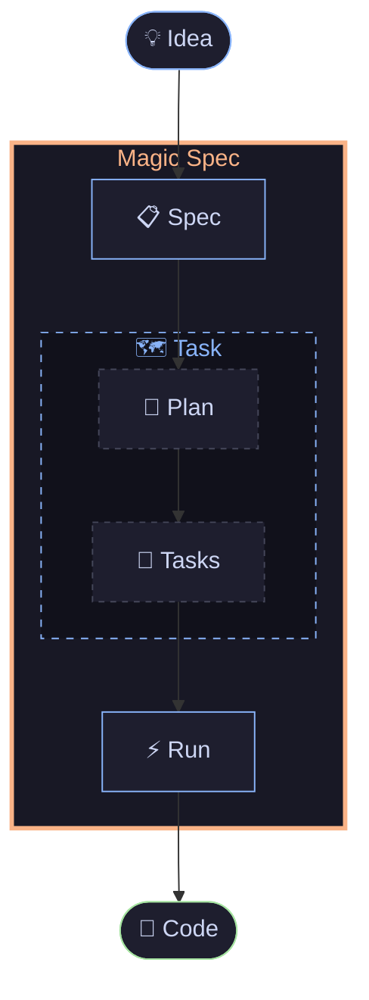

# 🪄 Magic Spec

[](https://www.npmjs.com/package/magic-spec)
[](https://pypi.org/project/magic-spec/)
[](./LICENSE)

## 📖 Description

**The Specification-Driven Development (SDD) Operating System for AI Coding Agents.**

Stop your AI from writing fragile code before it fully understands the problem. `magic-spec` installs a high-performance, structured pipeline — *Thought → Spec → Task → Run → Code* — directly into any project, regardless of the tech stack.

Whether you are a **coding novice** building your first application or a **senior engineer** architecting enterprise systems, Magic Spec brings **maximum automation** and professional rigor to your development process. It enforces a deterministic workflow that ensures your AI agent perfectly aligns with your vision before writing a single line of code.

### The Core Concept

`magic-spec` is a set of **markdown-based workflow instructions** specifically designed for AI coding agents like Cursor, Windsurf, Claude, and Gemini. It acts as a project-level operating system that orchestrates agentic development.

Instead of chaotic prompt-engineering, Magic Spec provides a rigorous pipeline:

```plaintext
💡 Idea  →  📋 Specification  →  🗺️ Task & Plan  →  ⚡ Run  →  🚀 Code
```

Once initialized, your AI agent will automatically:

- Formulate a strong conceptual and technical specification.
- Build a phased implementation plan with hierarchical dependencies.
- Decompose the plan into prioritized, atomic, trackable tasks.
- Facilitate safe architectural brainstorming via **Explore Mode**.
- Analyze its own workflow and suggest improvements via Auto-Retrospectives.

### What Gets Installed

After running the installer, your project directory will be augmented with the following structure:

```plaintext
root-project/
├── .agent/workflows/         # Slash commands wrapper (e.g., magic.spec, magic.task)
├── .magic/                   # The SDD Engine (workflow logic and scripts - read-only)
└── .design/                  # Your Project Design Workspace (INDEX.md, RULES.md, PLAN.md)
```

1. **`.magic/`**: Deploys the core SDD engine.
2. **`.agent/`**: Sets up workflows for your AI.
3. **`.design/`**: Initializes your project's workspace for Specifications, Rules, and Plans.
4. **Onboarding**: An interactive tutorial (`magic.onboard`) helps you and your AI get started smoothly.

> [!TIP]
> **Magic Workspaces**: Magic Spec supports multiple, isolated design environments within a single repository (e.g., `.design/engine/`, `.design/installers/`). This allows you to manage fundamentally different project domains without specification overlap, while sharing a single core engine. See [workspaces.md](./workspaces.md) for details.

## 🧠 The SDD Philosophy

> *"No code without a spec. No spec without a plan."*

Magic Spec is built around a single conviction: **AI agents write better code when they are forced to think before they act.** Left unconstrained, they jump straight to implementation — producing code that is fragile, misaligned, and expensive to refactor. Magic Spec installs a structured pipeline that makes this impossible.

### Human-Minimal Engineering

The core design goal is to **keep humans out of the loop as much as possible** — without sacrificing control over what actually matters.

Once you describe what you want, the engine takes over:

- Specifications are drafted, reviewed, and promoted through their lifecycle automatically.
- Tasks are decomposed, prioritized, and assigned default values without prompting.
- Phases execute end-to-end: retrospective snapshots fire, changelogs are compiled, and context files are regenerated — all silently.
- The only moments requiring human input are deliberate gates: approving a spec before implementation begins, and signing off on an external release changelog.

Everything else is automated. The agent does the engineering. You approve the direction.

### Two-Layer Specification Model

Every specification in Magic Spec belongs to one of two layers, and this separation is strictly enforced:

**Layer 1 — Concept** (`layer: concept`)
Technology-agnostic. Describes *what* the system must do: business rules, domain invariants, data contracts, and behavioral requirements. A Layer 1 spec can be ported to any tech stack without modification. It is the source of truth for the entire implementation.

**Layer 2 — Implementation** (`layer: implementation`)
Stack-specific. Describes *how* a Layer 1 concept is realized in a concrete technology (e.g., a Node.js REST API, a PostgreSQL schema, a React component). Every Layer 2 spec must declare its parent via `Implements: {l1-file.md}` and cannot reach `RFC` or `Stable` status until its parent is `Stable`.

This separation prevents a common failure mode in AI-assisted development: mixing "what we want" with "how we build it" in a single document, which leads to specs that are impossible to reuse, validate, or evolve independently.

> **Why this matters in practice:** Imagine you built your backend on Node.js + PostgreSQL. Six months later, performance demands require a migration to Go + ScyllaDB. With a two-layer model, your Layer 1 specs — authentication rules, data contracts, business logic — remain completely intact. Only the Layer 2 specs are rewritten to reflect the new stack. Your AI agent gets a clean, unambiguous brief for the migration without you having to re-explain the entire domain from scratch.

### Integrity by Design

The engine actively protects specification integrity throughout the project lifecycle:

- **Quarantine Cascade**: If a Layer 1 spec is destabilized (demoted from `Stable`), all dependent Layer 2 specs are automatically flagged and their tasks are blocked. The plan cannot proceed on a broken foundation.
- **Registry Parity**: Every spec that exists on disk must be registered in `INDEX.md`. Every registered spec must appear in the implementation plan or the backlog. Orphaned specs are treated as critical blockers.
- **Rules Parity**: If project conventions change (`RULES.md`), any existing task plan is flagged as stale. The agent will not execute tasks generated under outdated rules without an explicit sync.
- **Engine Integrity**: Core engine files are checksummed. Any untracked modification halts all workflows until the engine state is reconciled.

### Self-Improving Feedback Loop

Magic Spec includes a built-in retrospective engine that runs automatically at two levels:

- **Level 1** fires after every phase completes: captures a lightweight snapshot of spec health, task metrics, and signal status.
- **Level 2** fires when the full plan is complete: performs a deep audit — identifying spec drift, blocked-task patterns, shadow logic, and workflow friction — then produces actionable recommendations.

These retrospectives feed back into the specification layer, closing the loop between what was planned and what was actually built.

## 🖼️ Visuals

The engine enforces a rigorous, unskippable pipeline: **Idea → Specification → Task & Plan → Code**. AI agents are prevented from jumping straight to coding. They must first formally specify the solution, then break it down into a concrete plan and tasks, and only then proceed to execution.


```mermaid
flowchart TB
    IDEA(["💡 Idea"])

    subgraph BOX ["Magic Spec"]
        direction TB

        SPEC["📋 Spec"]

        subgraph TASK ["🗺️ Task"]
            direction TB
            PLAN["📐 Plan"]
            TASKS["📌 Tasks"]
            PLAN --> TASKS
        end

        RUN["⚡ Run"]

        SPEC  --> PLAN
        TASKS --> RUN
    end

    CODE(["🚀 Code"])

    IDEA --> SPEC
    RUN  --> CODE

    style IDEA  fill:#1e1e2e,stroke:#89b4fa,color:#cdd6f4
    style CODE  fill:#1e1e2e,stroke:#a6e3a1,color:#cdd6f4

    style BOX   fill:#181825,stroke:#fab387,stroke-width:3px,color:#fab387

    style SPEC  fill:#1e1e2e,stroke:#89b4fa,color:#cdd6f4
    style RUN   fill:#1e1e2e,stroke:#89b4fa,color:#cdd6f4

    style TASK  fill:#11111b,stroke:#89b4fa,stroke-dasharray:5 5,color:#89b4fa
    style PLAN  fill:#1e1e2e,stroke:#45475a,stroke-dasharray:4 4,color:#cdd6f4
    style TASKS fill:#1e1e2e,stroke:#45475a,stroke-dasharray:4 4,color:#cdd6f4
```

## ⚙️ Requirements

Before installing Magic Spec, ensure you have one of the following available on your system:

| Requirement | Details |
| :--- | :--- |
| **Node.js** | Version `16.x` or higher (for `npx` method) |
| **Python** | Version `3.8` or higher (for `uvx` or `pipx` methods) |
| **Git** | Required for installing edge versions directly from GitHub |
| **Terminal** | `tar` utility (pre-installed on Windows/Linux/macOS) |

## 📦 Installation

Works perfectly with **any project** — Rust, Go, Python, JavaScript, C++, or anything else. No runtime lock-in.

### Option A: Node.js (`npx`)

**Stable Release:**

```bash
# Basic installation (defaults to .agent/ folder)
npx magic-spec@latest

# Targeted installation for Cursor
npx magic-spec@latest --cursor
```

**Edge Version (GitHub):**

```bash
npx --yes github:teratron/magic-spec
```

### Option B: Python (`uvx`)

**Stable Release:**

```bash
# Basic installation
uvx magic-spec

# Targeted installation for Windsurf
uvx magic-spec --windsurf
```

**Edge Version (GitHub):**

```bash
uvx --from git+https://github.com/teratron/magic-spec.git magic-spec
```

### Option C: Python (`pipx`)

```bash
pipx run magic-spec
```

### Option D: Multi-Adapter Installation

You can install support for multiple adapters at once:

```bash
npx magic-spec@latest --cursor --copilot --windsurf
```

### Option E: Manual Installation

If automated installers do not fit your environment:

1. **Engine**: Download the `.magic/` folder from the [GitHub repository](https://github.com/teratron/magic-spec).
2. **Workflows**: Download command wrappers from [`.agent/workflows/`](https://github.com/teratron/magic-spec/tree/main/.agent/workflows).
3. **Deploy**: Place files into your AI agent's instruction directory (e.g., `.cursor/commands`).

## 🔄 Updating

Keep your SDD engine up to date with the latest logic and features:

```bash
# Check if update is available
npx magic-spec@latest --check

# Perform the update
npx magic-spec@latest --update
```

> [!TIP]
> The update process preserves your `.design/` workspace and automatically creates backups of `.magic/` and `.agent/` folders. If you have modified core engine files, the installer will detect conflicts and ask for your preference (overwrite, skip, or abort).

## 💬 Usage

Just talk to your AI agent naturally in your prompt interface. No complex commands to learn:

- *"Dispatch this thought into specs..."* → Triggers **Specification** workflow.
- *"Create an implementation plan"* → Triggers **Task & Plan** workflow.
- *"Execute the next task"* → Triggers **Run** workflow.
- *"Add a rule: always use Inter font"* → Triggers **Rule** workflow.

### 🤝 Compatibility

Magic Spec is heavily optimized and provides native workflow generation for the world's most powerful AI development environments.

You can install support for a specific adapter using the shortcut flag (e.g., `--cursor`) or the environment flag (e.g., `--env cursor`).

| AI Agent / IDE | Shortcut Flag | Env Flag |
| :--- | :--- | :--- |
| [**Cursor**](https://cursor.com) (Agent Mode) | `--cursor` | `--env cursor` |
| [**Windsurf**](https://codeium.com/windsurf) (Cascade) | `--windsurf` | `--env windsurf` |
| [**Claude Code**](https://claude.ai/code) | `--claude` | `--env claude` |
| [**Gemini CLI**](https://gemini.google.com) | `--gemini` | `--env gemini` |
| [**GitHub Copilot**](https://github.com/features/copilot) | `--copilot` | `--env copilot` |
| **Roo Code** | `--roo` | `--env roo` |
| **Amp** | `--amp` | `--env amp` |
| **Amazon Q Developer** | `--q` | `--env q` |
| **Kilo Code** | `--kilocode` | `--env kilocode` |
| **Qwen Code** | `--qwen` | `--env qwen` |
| **OpenCode** | `--opencode` | `--env opencode` |
| **SHAI (OVHcloud)** | `--shai` | `--env shai` |
| **IBM Bob** | `--bob` | `--env bob` |
| **CodeBuddy** | `--codebuddy` | `--env codebuddy` |
| **Qoder IDE** | `--qoder` | `--env qoder` |
| **Codex CLI** | `--codex` | `--env codex` |
| **Auggie CLI** | `--augment` | `--env augment` |
| **Antigravity IDE** | `--antigravity` | `--env antigravity` |
| **Lingma IDE** | `--lingma` | `--env lingma` |

## 📚 Documentation

- [**Main Documentation**](./docs/README.md) — Detailed guide on workflows, architecture, and advanced features.
- [**Installers Guide**](./installers/README.md) — Advanced CLI options and platform specifics.
- [**Contributing**](./docs/contributing.md) — How to develop, test, and extend the engine.

## 🛟 Support

If you encounter issues or have questions:

- Open an [Issue](https://github.com/teratron/magic-spec/issues) on GitHub.
- Run `magic.onboard` in your agent to restart the interactive tutorial.

## 🗺️ Roadmap

- [x] Multi-agent adapter system.
- [x] Phased implementation planning.
- [ ] Extended support for local-first LLM agents.
- [ ] Advanced visual dashboard for project health.
- [ ] Integration with CI/CD for automated spec validation.

## 🏗️ Contributing

We welcome contributions! Whether it's a bug fix, a new adapter, or an improvement to the workflow logic.
Please see [**Contributing Guide**](./docs/contributing.md) for details.

## 👥 Authors and Acknowledgments

- **Oleg Alexandrov** — Creator and Lead Maintainer.
- Special thanks to the AI agent community for inspiration and testing.

## 📄 License

Distributed under the [MIT License](./LICENSE).

## 📊 Project Status

**Active Development** (v1.x). We are constantly refining the SDD engine based on real-world usage.
