# 🪄 Magic Spec

[](https://www.npmjs.com/package/magic-spec)
[](https://pypi.org/project/magic-spec/)
[](./LICENSE)

**The Specification-Driven Development (SDD) Operating System for AI Coding Agents.**

Stop your AI from writing fragile code before it fully understands the problem. `magic-spec` installs a high-performance, structured pipeline — *Thought → Spec → Task → Run → Code* — directly into any project, regardless of the tech stack.

Whether you are a **coding novice** building your first application or a **senior engineer** architecting enterprise systems, Magic Spec brings **maximum automation** and professional rigor to your development process. It enforces a deterministic workflow that ensures your AI agent perfectly aligns with your vision before writing a single line of code.

---

## ✨ The Core Concept

`magic-spec` is a set of **markdown-based workflow instructions** specifically designed for AI coding agents like Cursor, Windsurf, Claude, and Gemini. It acts as a project-level operating system that orchestrates agentic development.

Instead of chaotic prompt-engineering, Magic Spec provides a rigorous pipeline:

```plaintext
💡 Idea  →  📋 Specification  →  🗺️ Task & Plan  →  ⚡ Run  →  🚀 Code
```

Once initialized, your AI agent will automatically:

- Formulate a strong conceptual and technical specification.
- Build a phased implementation plan with hierarchical dependencies.
- Decompose the plan into prioritized, atomic, trackable tasks.
- Facilitate safe architectural brainstorming via **Explore Mode**.
- Analyze its own workflow and suggest improvements via Auto-Retrospectives.
- Provide a smooth onboarding experience with `magic.onboard`.

**No code is written until a specification exists. No spec is implemented without a plan.**

---

## 🧭 Philosophy & Principles

| Principle | Description |
| :--- | :--- |
| **For All Skill Levels** | **Beginners** get a guiding hand and automated best practices. **Experts** get a strict constitutional framework that prevents AI hallucination and enforces architectural integrity. |
| **Specs First** | No code is allowed before a specification is drafted and accepted. |
| **Maximum Automation** | Reduces manual project management. Automated tracking, checking, and retrospectives keep the project moving forward flawlessly. |
| **Deterministic** | A strict, unskippable pipeline from thought to deployment. |
| **Constitutional** | All project conventions live in `RULES.md` — the ultimate source of truth. |

---

## 🚀 Quick Start (Installation)

Works perfectly with **any project** — Rust, Go, Python, JavaScript, C++, or anything else.  
No runtime lock-in. It requires only Node.js or Python to install.

### Option A: Node.js (`npx`)

**Recommended for stable release:**

```bash
npx magic-spec@latest
```

**Install the latest edge version directly from the GitHub repository:**

```bash
npx --yes github:teratron/magic-spec
```

### Option B: Python (`uvx`)

**Recommended for stable release:**

```bash
uvx magic-spec
```

**Install the latest edge version directly from the GitHub repository:**

```bash
uvx --from git+https://github.com/teratron/magic-spec.git magic-spec
```

### Option C: Python (`pipx`)

If you prefer `pipx` over `uv`:

```bash
pipx run magic-spec
```

---

## 📁 What Gets Installed

After running the installer, your project directory will be augmented with the following structure:

```plaintext
root-project/
├── .agent/workflows/         # Slash commands wrapper (e.g., magic.spec, magic.task)
├── .magic/                   # The SDD Engine (workflow logic and scripts - read-only)
└── .design/                  # Your Project Design Workspace (INDEX.md, RULES.md, PLAN.md)
```

1. **`.magic/`**: Deploys the core SDD engine.
2. **`.agent/`**: Sets up workflows for your AI.
3. **`.design/`**: Initializes your project's workspace for Specifications, Rules, and Plans.
4. **Onboarding**: An interactive tutorial (`magic.onboard`) helps you and your AI get started smoothly.

---

## 🔗 The Workflow Pipeline

The engine operates on a smart, self-correcting feedback loop:

```mermaid
graph TD
    IDEA["💡 Idea"] --> INIT{"🏗️ Auto-Init"}
    INIT -->|.design/ exists| SPEC
    INIT -->|.design/ missing| CREATE["Create .design/ structure"] --> SPEC
    SPEC["📋 Specification"] <--> RULE["📜 Rule"]
    SPEC --> TASK["🗺️ Task & Plan"]
    TASK --> RUN["⚡ Run"]
    RUN --> CODE["🚀 Code"]
    RUN -.->|"auto: phase done"| RETRO["🔍 Retrospective"]
    RETRO -.->|Feedback loop| SPEC
```



### Core Workflows

| # | Workflow | Purpose |
| :--- | :--- | :--- |
| **1** | **Specification** | Converts raw thoughts into structured, technical specs. Verifies sync. |
| **2** | **Task & Plan** | Builds the dependency graph, `PLAN.md`, and atomic task files. |
| **3** | **Run (Execution)** | Executes the plan with automatic progress tracking and quality gates. |
| **4** | **Rule** | Manages project conventions in a central constitutional `RULES.md` file. |

---

## 💬 How to Use

You don't need to memorize complex commands. Just talk to your AI agent naturally in your prompt interface:

- *"Dispatch this thought into specs..."* → Triggers the Specification workflow
- *"Create an implementation plan for the new feature"* → Triggers the Task workflow
- *"Execute the next task on the plan"* → Triggers the Run workflow
- *"Add a rule: always use the Inter font for UI"* → Triggers the Rule workflow

---

## 🔄 Updating Magic Spec

Keep your engine up-to-date with the latest improvements:

```bash
# For Node.js users:
npx magic-spec@latest --update

# For Python (uv) users:
uvx magic-spec --update
```

---

## 🤝 Compatibility

Magic Spec is heavily optimized and provides native workflow generation for the world's most powerful AI development environments:

| AI Agent / IDE | Installation Flag |
| :--- | :--- |
| [**Cursor**](https://cursor.com) (Agent Mode) | `--cursor` |
| [**Windsurf**](https://codeium.com/windsurf) (Cascade) | `--windsurf` |
| [**Claude Code**](https://claude.ai) | `--claude` |
| [**Gemini CLI**](https://gemini.google.com) | `--gemini` |
| [**GitHub Copilot**](https://github.com/features/copilot) | `--copilot` |
| **Roo Code** | `--roo` |
| **Amp** | `--amp` |
| **Amazon Q Developer** | `--q` |
| **Kilo Code** | `--kilocode` |
| **Qwen Code** | `--qwen` |
| **OpenCode** | `--opencode` |
| **SHAI (OVHcloud)** | `--shai` |
| **IBM Bob** | `--bob` |
| **CodeBuddy** | `--codebuddy` |
| **Qoder IDE** | `--qoder` |
| **Codex CLI** | `--codex` |
| **Auggie CLI** | `--augment` |
| **Antigravity IDE** | `--antigravity` |
| **Lingma IDE** | `--lingma` |

---

## 📖 Documentation & Guides

- [**Main Documentation**](./docs/README.md) — Detailed guide on workflows, architecture, and advanced features.
- [**Installers Guide**](./installers/README.md) — Advanced CLI options and platform specifics.
- [**Contributing**](./docs/contributing.md) — How to develop, test, and extend the engine.

---

## 📄 License

Distributed under the [MIT License](./LICENSE). © 2026 Oleg Alexandrov
