```mermaid
graph TD
    IDEA["💡 Idea"] --> INIT{"🏗️ Auto-Init"}
    INIT -->|.design/ exists| SPEC
    INIT -->|.design/ missing| CREATE["Create .design/ structure"] --> SPEC
    SPEC["📋 Specification"] <--> RULE["📜 Rule"]
    SPEC --> TASK["🗺️ Task & Plan"]
    TASK --> RUN["⚡ Run"]
    RUN --> CODE["🚀 Code"]
    RUN -.->|"auto: phase done"| RETRO["🔍 Retrospective"]
    RETRO -.->|Feedback loop| SPEC
```

# 🪄 Magic Spec

[](https://www.npmjs.com/package/magic-spec)
[](https://pypi.org/project/magic-spec/)
[](./LICENSE)

## 📖 Description

**The Specification-Driven Development (SDD) Operating System for AI Coding Agents.**

Stop your AI from writing fragile code before it fully understands the problem. `magic-spec` installs a high-performance, structured pipeline — *Thought → Spec → Task → Run → Code* — directly into any project, regardless of the tech stack.

Whether you are a **coding novice** building your first application or a **senior engineer** architecting enterprise systems, Magic Spec brings **maximum automation** and professional rigor to your development process. It enforces a deterministic workflow that ensures your AI agent perfectly aligns with your vision before writing a single line of code.

### The Core Concept

`magic-spec` is a set of **markdown-based workflow instructions** specifically designed for AI coding agents like Cursor, Windsurf, Claude, and Gemini. It acts as a project-level operating system that orchestrates agentic development.

Instead of chaotic prompt-engineering, Magic Spec provides a rigorous pipeline:

```plaintext
💡 Idea  →  📋 Specification  →  🗺️ Task & Plan  →  ⚡ Run  →  🚀 Code
```

Once initialized, your AI agent will automatically:

- Formulate a strong conceptual and technical specification.
- Build a phased implementation plan with hierarchical dependencies.
- Decompose the plan into prioritized, atomic, trackable tasks.
- Facilitate safe architectural brainstorming via **Explore Mode**.
- Analyze its own workflow and suggest improvements via Auto-Retrospectives.

### What Gets Installed

After running the installer, your project directory will be augmented with the following structure:

```plaintext
root-project/
├── .agent/workflows/         # Slash commands wrapper (e.g., magic.spec, magic.task)
├── .magic/                   # The SDD Engine (workflow logic and scripts - read-only)
└── .design/                  # Your Project Design Workspace (INDEX.md, RULES.md, PLAN.md)
```

1. **`.magic/`**: Deploys the core SDD engine.
2. **`.agent/`**: Sets up workflows for your AI.
3. **`.design/`**: Initializes your project's workspace for Specifications, Rules, and Plans.
4. **Onboarding**: An interactive tutorial (`magic.onboard`) helps you and your AI get started smoothly.

## 🖼️ Visuals

The engine operates on a smart, self-correcting feedback loop:



## ⚙️ Requirements

Before installing Magic Spec, ensure you have one of the following available on your system:

| Requirement | Details |
| :--- | :--- |
| **Node.js** | Version `16.x` or higher (for `npx` method) |
| **Python** | Version `3.8` or higher (for `uvx` or `pipx` methods) |
| **Git** | Required for installing edge versions directly from GitHub |
| **Terminal** | `tar` utility (pre-installed on Windows/Linux/macOS) |

## 📦 Installation

Works perfectly with **any project** — Rust, Go, Python, JavaScript, C++, or anything else. No runtime lock-in.

### Option A: Node.js (`npx`)

**Stable Release:**

```bash
# Basic installation (defaults to .agent/ folder)
npx magic-spec@latest

# Targeted installation for Cursor
npx magic-spec@latest --cursor
```

**Edge Version (GitHub):**

```bash
npx --yes github:teratron/magic-spec
```

### Option B: Python (`uvx`)

**Stable Release:**

```bash
# Basic installation
uvx magic-spec

# Targeted installation for Windsurf
uvx magic-spec --windsurf
```

**Edge Version (GitHub):**

```bash
uvx --from git+https://github.com/teratron/magic-spec.git magic-spec
```

### Option C: Python (`pipx`)

```bash
pipx run magic-spec
```

### Option D: Multi-Adapter Installation

You can install support for multiple adapters at once:

```bash
npx magic-spec@latest --cursor --copilot --windsurf
```

### Option E: Manual Installation

If automated installers do not fit your environment:

1. **Engine**: Download the `.magic/` folder from the [GitHub repository](https://github.com/teratron/magic-spec).
2. **Workflows**: Download command wrappers from [`.agent/workflows/`](https://github.com/teratron/magic-spec/tree/main/.agent/workflows).
3. **Deploy**: Place files into your AI agent's instruction directory (e.g., `.cursor/commands`).

## � Updating

Keep your SDD engine up to date with the latest logic and features:

```bash
# Check if update is available
npx magic-spec@latest --check

# Perform the update
npx magic-spec@latest --update
```

> [!TIP]
> The update process preserves your `.design/` workspace and automatically creates backups of `.magic/` and `.agent/` folders. If you have modified core engine files, the installer will detect conflicts and ask for your preference (overwrite, skip, or abort).

## �🚀 Usage

Just talk to your AI agent naturally in your prompt interface. No complex commands to learn:

- *"Dispatch this thought into specs..."* → Triggers **Specification** workflow.
- *"Create an implementation plan"* → Triggers **Task & Plan** workflow.
- *"Execute the next task"* → Triggers **Run** workflow.
- *"Add a rule: always use Inter font"* → Triggers **Rule** workflow.

### 🤝 Compatibility

Magic Spec is heavily optimized and provides native workflow generation for the world's most powerful AI development environments:

| AI Agent / IDE | Installation Flag |
| :--- | :--- |
| [**Cursor**](https://cursor.com) (Agent Mode) | `--cursor` |
| [**Windsurf**](https://codeium.com/windsurf) (Cascade) | `--windsurf` |
| [**Claude Code**](https://claude.ai/code) | `--claude` |
| [**Gemini CLI**](https://gemini.google.com) | `--gemini` |
| [**GitHub Copilot**](https://github.com/features/copilot) | `--copilot` |
| **Roo Code** | `--roo` |
| **Amp** | `--amp` |
| **Amazon Q Developer** | `--q` |
| **Kilo Code** | `--kilocode` |
| **Qwen Code** | `--qwen` |
| **OpenCode** | `--opencode` |
| **SHAI (OVHcloud)** | `--shai` |
| **IBM Bob** | `--bob` |
| **CodeBuddy** | `--codebuddy` |
| **Qoder IDE** | `--qoder` |
| **Codex CLI** | `--codex` |
| **Auggie CLI** | `--augment` |
| **Antigravity IDE** | `--antigravity` |
| **Lingma IDE** | `--lingma` |

## 📚 Documentation

- [**Main Documentation**](./docs/README.md) — Detailed guide on workflows, architecture, and advanced features.
- [**Installers Guide**](./installers/README.md) — Advanced CLI options and platform specifics.
- [**Contributing**](./docs/contributing.md) — How to develop, test, and extend the engine.

## 🛟 Support

If you encounter issues or have questions:

- Open an [Issue](https://github.com/teratron/magic-spec/issues) on GitHub.
- Run `magic.onboard` in your agent to restart the interactive tutorial.

## 🗺️ Roadmap

- [x] Multi-agent adapter system.
- [x] Phased implementation planning.
- [ ] Extended support for local-first LLM agents.
- [ ] Advanced visual dashboard for project health.
- [ ] Integration with CI/CD for automated spec validation.

## 🤝 Contributing

We welcome contributions! Whether it's a bug fix, a new adapter, or an improvement to the workflow logic.
Please see [**Contributing Guide**](./docs/contributing.md) for details.

## 👥 Authors and Acknowledgments

- **Oleg Alexandrov** — Creator and Lead Maintainer.
- Special thanks to the AI agent community for inspiration and testing.

## 📄 License

Distributed under the [MIT License](./LICENSE).

## 📊 Project Status

**Active Development** (v1.x). We are constantly refining the SDD engine based on real-world usage.
