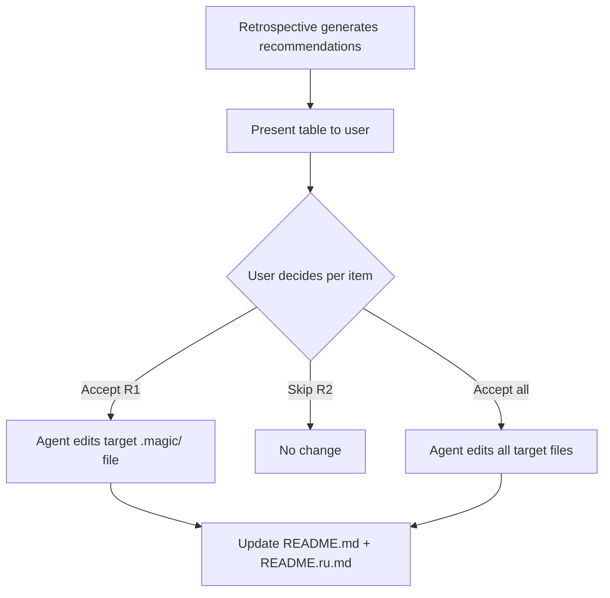

# 🪄 Magic — Specification-Driven Development (SDD) Workflow

Magic is an agentic, Specification-Driven Development (SDD) workflow system. It enforces a rigorous, structured pipeline for AI coding agents, ensuring that **no code is written until a specification is defined, reviewed, and planned.**

It consists of a set of markdown-based workflow instructions for AI agents, effectively acting as an operating system for agentic development.

## 🧭 Core Philosophy

1. **Specs First, Code Later:** The agent is strictly forbidden from writing implementation code from raw user input. All ideas must first be synthesized into a Specification (`.design/specifications/*.md`).
2. **Deterministic Process:** The system enforces a strict pipeline: *Thought → Spec → Plan → Task → Code*.
3. **Constitution-Driven:** All logic is governed by a central rulebook (`.design/RULES.md`), which acts as the project's living constitution.
4. **Self-Improving:** After each phase and at plan completion, the Task workflow automatically runs a retrospective, collecting metrics and generating actionable recommendations — no manual command needed.

## 🔗 The Pipeline

Magic operates through **3 core workflows** and **1 auxiliary workflow**, forming a complete lifecycle — from raw idea to implemented code, with built-in self-analysis. Initialization is automatic and requires no manual command.

```mermaid
graph TD
    IDEA["💡 Idea"] --> INIT{"🏗️ Auto-Init<br/>init.md"}
    INIT -->|.design/ exists| SPEC
    INIT -->|.design/ missing| CREATE["Create .design/ structure"] --> SPEC
    SPEC["📋 Specification<br/>specification.md"] <--> RULE["📜 Rule<br/>rule.md"]
    SPEC --> PLAN["🗺️ Plan<br/>plan.md"]
    PLAN --> TASK["⚡ Task<br/>task.md"]
    TASK --> CODE["🚀 Code"]
    TASK -.->|"auto: phase done"| RETRO["🔍 Retrospective<br/>retrospective.md"]
    RETRO -.->|Feedback loop| SPEC

    style INIT fill:#2d333b,stroke:#f0883e,stroke-dasharray: 5 5
    style RULE fill:#2d333b,stroke:#8b949e,stroke-dasharray: 3 3
    style RETRO fill:#2d333b,stroke:#8b949e,stroke-dasharray: 3 3
```



### Core Workflows

| # | Workflow | File | Purpose |
|---|---|---|---|
| 1 | **Specification** | `specification.md` | 📋 Converts raw thoughts into structured specs. Verifies consistency with the project state. Manages statuses (Draft → RFC → Stable → Deprecated) |
| 2 | **Plan** | `plan.md` | 🗺️ Reads Stable specs, builds dependency graph, extracts critical path, produces phased `PLAN.md` |
| 3 | **Task** | `task.md` | ⚡ Decomposes Plan into atomic tasks with execution tracks. Sequential & Parallel modes. Automatically triggers Retrospective at phase and plan completion |

### Auxiliary Workflow

| Workflow | File | Purpose |
|---|---|---|
| **Rule** | `rule.md` | 📜 Manages the project constitution (`RULES.md §7`). Add / Amend / Remove / List conventions |

### Auto-Init & Auto-Retrospective

| | File | Purpose |
|---|---|---|
| **Init** | `init.md` + `scripts/` | 🏗️ Automatic pre-flight check. On first invocation of any workflow, verifies `.design/` exists. If not — creates the directory structure, `INDEX.md`, and `RULES.md`. No manual command needed |
| **Check Specs** | `specification.md` | ⚖️ Pre-flight consistency check. Runs before planning/task generation to verify specs match actual project paths, structures, and configs |
| **Retrospective** | `retrospective.md` | 🔍 Called automatically by `task.md`: Level 1 snapshot after each phase, Level 2 full analysis when the entire plan completes. Not a user command |

## 🏗️ Architecture & Directory Structure

The SDD system consists of three main directories:

1. **`.agent/workflows/magic.*.md`** — AI agent entry points (e.g., slash commands in Cursor or Claude). These thin wrappers (~12 lines each) trigger the actual Magic workflows. There are **5 wrappers**: onboard, specification, plan, task, rule.
2. **`.magic/`** — The core SDD engine: workflow definitions, templates, scripts, and documentation. Immutable during normal operation.
3. **`.design/`** — The living state of your project. All generated specs, plans, tasks, and retrospectives reside here.

### 📁 Complete Structure Overview

```plaintext
project-root/
│
├── .agent/workflows/               # 🎯 Agent Triggers (entry points)
│   ├── magic.onboard.md            #    → triggers .magic/onboard.md
│   ├── magic.plan.md               #    → triggers .magic/plan.md
│   ├── magic.rule.md               #    → triggers .magic/rule.md
│   ├── magic.specification.md      #    → triggers .magic/specification.md
│   └── magic.task.md               #    → triggers .magic/task.md
│
├── .magic/                     # ⚙️ SDD Engine (workflow logic)
│   ├── README.md               #    Documentation (EN)
│   ├── README.ru.md            #    Documentation (RU)
│   ├── init.md                 #    Auto-init logic (pre-flight check)
│   ├── onboard.md              #    Interactive onboarding tutorial script
│   ├── plan.md                 #    Planning workflow + templates
│   ├── retrospective.md        #    Self-analysis engine (auto-triggered by task.md)
│   ├── rule.md                 #    Constitution management workflow (auxiliary)
│   ├── specification.md        #    Specification authoring workflow + templates
│   ├── task.md                 #    Task decomposition & execution workflow
│   └── scripts/                #    Init scripts (auto-run on first use)
│       ├── init.sh             #       macOS / Linux
│       └── init.ps1            #       Windows
│
└── .design/                    # 📦 Project State & Artifacts (generated)
    ├── INDEX.md                #    Spec registry (names, statuses, versions)
    ├── RULES.md                #    Project constitution
    ├── PLAN.md                 #    Implementation plan with phases
    ├── RETROSPECTIVE.md        #    SDD usage analytics & recommendations
    ├── specifications/         #    Specification files
    │   └── *.md
    └── tasks/                  #    Task execution breakdowns
        ├── TASKS.md            #    Master task index
        └── phase-*.md          #    Per-phase tracks & sequences
```

## ✅ Agent Guidelines & Checklists

To prevent AI hallucination, context drift, or skipped steps, every workflow in Magic enforces **Task Completion Checklists**. An AI agent is not permitted to complete an operation or start writing code without first presenting a confirmed checklist to the user, proving that all bounds, rules, and structures have been respected.

Each checklist item must be marked `✓` (done) or `✗` (skipped/failed). Any `✗` requires an explanation. A task with unresolved `✗` items is **not complete**.

## 🔍 Retrospective — Automatic Feedback Loop

The Retrospective is Magic's **self-improvement mechanism**, built directly into the Task workflow. It closes the feedback loop by analyzing actual SDD usage data and producing actionable recommendations — without requiring any manual command.

### Two-Level System

| Level | Name | Trigger | Cost | Output |
|---|---|---|---|---|
| **Level 1** | Auto-snapshot | Automatic after every phase completion | ~10s | One row appended to Snapshots table in `RETROSPECTIVE.md` |
| **Level 2** | Full retrospective | Automatic when entire plan completes | ~2–5 min | Full analysis + recommendations presented to user |

**Level 1** collects numbers silently — no analysis, no user interruption. It creates a trail of metrics for trend analysis.

**Level 2** performs deep analysis and generates actionable recommendations. It uses Level 1 snapshots for trend comparison and presents results for user review before any changes are applied.

### Why It Exists

Without a feedback loop, the SDD system can accumulate:

- 🧊 **Dead checklists** — items that always pass and waste agent context
- 🔄 **Recurring bottlenecks** — blocking patterns that repeat across phases
- 👻 **Phantom references** — specs in PLAN.md that don't exist in INDEX.md, or vice versa
- 📉 **Workflow friction** — steps that look good on paper but slow down real work

The Retrospective detects these issues **before they compound**.

### When It Runs

| Trigger | Level | Behaviour |
|---|---|---|
| 🏁 Phase complete | **Level 1** | Auto-snapshot: silent, no interruption |
| 🎯 Entire plan complete | **Level 2** | Full retro: auto-runs, presents report |
| 📝 Every 5th spec update | — | Suggests: *"Run retrospective?"* (manual) |
| 🗺️ Plan restructure | — | Suggests: *"Run retrospective?"* (manual) |

### How Recommendations Are Applied

The retrospective is **read-only** — it diagnoses, but never self-modifies. All changes to `.magic/` files require explicit user approval:



> **Rule:** Any accepted recommendation that modifies a `.magic/` workflow file **must** also update `.magic/README.md` and `.magic/README.ru.md` to keep documentation in sync.

## 🚀 Usage

Simply instruct your AI agent (Cursor, Claude, Gemini, or any terminal agent). Initialization is automatic — no setup command required.

### Core Commands

| Command | What Happens |
|---|---|
| *"Dispatch this thought into specs..."* | Runs Specification → parses, maps, and writes spec files |
| *"Create an implementation plan"* | Runs Plan → builds phased plan with dependency graph |
| *"Generate tasks for Phase 1"* | Runs Task → decomposes plan into atomic tasks with tracks |
| *"Execute the next task"* | Runs Task → picks and implements the next available task |

### Auxiliary Commands (optional)

| Command | What Happens |
|---|---|
| *"Check if specs match the actual project state"* | Runs Specification → executes Consistency Check (Pre-flight) |
| *"Add rule: always use snake_case naming"* | Runs Rule → adds convention to RULES.md §7 |

> **Auto-Init:** On first invocation of any command, the system automatically checks for `.design/` and creates it if missing. No manual initialization needed.
>
> **Auto-Retrospective:** Runs automatically inside Task workflow at phase and plan completion. No command needed.

The AI will automatically read the corresponding `.magic/*.md` workflow file and execute the request within the bounds of the SDD system. No code escapes the pipeline. ✨
