# 🪄 Magic Spec — The SDD Operating System

Magic Spec is an agentic, Specification-Driven Development (SDD) workflow system. It acts as an operating system for AI coding agents, enforcing a rigorous, structured pipeline that ensures **no code is written until a specification is defined, reviewed, and planned.**

---

## 🧭 Core Philosophy

1. **Specs First, Code Later**: The AI agent is strictly forbidden from writing implementation code from raw user input. All ideas must first be synthesized into a Specification (`.design/specifications/*.md`).
2. **Deterministic Process**: The system enforces a strict pipeline: *Thought → Spec → Task → Run → Code*.
3. **Governance via Rules**: All logic is governed by a central rulebook (`.design/RULES.md`), which acts as the project's living constitution.
4. **Continuous Self-Improvement**: Built-in auto-retrospectives analyze actual usage data and provide actionable recommendations after every phase.

---

## 🔗 The Workflow Pipeline

Magic operates through **3 core workflows** and **1 auxiliary workflow**, forming a complete lifecycle from raw idea to implemented code.

```mermaid
graph TD
    IDEA["💡 Idea"] --> INIT{"🏗️ Auto-Init"}
    INIT -->|.design/ exists| SPEC
    INIT -->|.design/ missing| CREATE["Create .design/ structure"] --> SPEC
    INIT -.->|"existing code detected"| ANALYZE["🔬 Analyze"]
    ANALYZE -->|"proposals approved"| SPEC
    SPEC["📋 Specification"] <--> RULE["📜 Rule"]
    SPEC --> TASK["🗺️ Task & Plan"]
    TASK --> RUN["⚡ Run"]
    RUN --> CODE["🚀 Code"]
    RUN -.->|"auto: phase done"| RETRO["🔍 Retrospective"]
    RETRO -.->|Feedback loop| SPEC

    style INIT fill:#1e1e2e,stroke:#fab387,stroke-dasharray: 5 5
    style ANALYZE fill:#1e1e2e,stroke:#74c7ec,stroke-dasharray: 5 5
    style RULE fill:#1e1e2e,stroke:#9399b2,stroke-dasharray: 3 3
    style RETRO fill:#1e1e2e,stroke:#9399b2,stroke-dasharray: 3 3
```



### Core Workflows

| # | Workflow | Primary File | Purpose | Documentation |
| ---: | :--- | :--- | :--- | :--- |
| **1** | **Specification** | `spec.md` | Converts thoughts into structured specs. Manages lifecycle (Draft → RFC → Stable). | [Detailed Guide](spec.md) |
| **2** | **Task** | `task.md` | Reads Stable specs, builds dependency graphs, and decomposes them into atomic tasks in `PLAN.md` and `TASKS.md`. | [Detailed Guide](task.md) |
| **3** | **Run** | `run.md` | Executes tasks sequentially or in parallel. Triggers automatic retrospectives at phase completion. | [Detailed Guide](run.md) |

### Auxiliary Workflows

| Workflow | Primary File | Purpose | Documentation |
| :--- | :--- | :--- | :--- |
| **Rule** | `rule.md` | Manages the project constitution (`RULES.md`). Add/Amend/Remove project conventions. | [Detailed Guide](rule.md) |
| **Onboard** | `onboard.md` | Provides an interactive tutorial for developers and AI agents to learn the SDD lifecycle. | [Detailed Guide](onboard.md) |
| **Retrospective** | `retrospective.md` | Collects metrics and generates improvement recommendations after phase/plan completion. | [Detailed Guide](retrospective.md) |
| **Simulate** | `simulate.md` | Validates engine logic and optimizes workflow instructions (AOP). | [Detailed Guide](simulate.md) |
| **Init** | `init.md` | Automatic pre-flight initialization of the `.design/` directory. | [Detailed Guide](init.md) |
| **Analyze** | `analyze.md` | Scans existing codebases to generate specification proposals. Supports first-time analysis and re-analysis. | [Detailed Guide](analyze.md) |

---

## 🏗️ Architecture & Directory Structure

Once installed, Magic Spec sets up a clear separation of concerns in your project:

```plaintext
your-project/
├── .agent/workflows/       # 🎯 Agent Entry Points (Slash Commands)
│   └── magic.spec.md       #    → (Note: Adapters like Cursor use .cursor/rules/)
├── .magic/                 # ⚙️ SDD Engine (Workflow logic & Scripts)
│   ├── spec.md, task.md    #    Core logic definitions
│   └── scripts/            #    Initialization & health-check scripts
└── .design/                # 📦 Project State & Artifacts (Generated)
    ├── INDEX.md            #    Specification registry
    ├── RULES.md            #    Project constitution (The Rules)
    ├── PLAN.md             #    The implementation roadmap
    └── specifications/     #    Directory for all .md spec files
```

---

## 🚀 Usage Guide

Talk to your AI agent (Cursor, Windsurf, Claude, etc.) using the following natural language triggers:

### 1. Authoring Specifications
>
> *"Analyze this idea and create a new specification."*
The agent will run the **Specification** workflow, creating a file in `.design/specifications/` and updating the `INDEX.md`.

### 2. Planning Implementation
>
> *"Build an implementation plan for the stable specs."*
The agent will run the **Task** workflow, generating a phased `PLAN.md` and decomposing it into atomic units in `TASKS.md`.

### 3. Executing Tasks
>
> *"Start the implementation from the next task."*
The agent will run the **Run** workflow, picking the most prioritized task and implementing it.

---

## ⚖️ Consistency & Safety

Magic Spec includes built-in "Pre-flight" checks:

- **Consistency Check**: Before planning, the engine verifies that specifications match the actual file structure and project configuration.
- **Task Verification**: No task is marked complete without a confirmed completion checklist presented to the user.

---

## 🔍 Self-Improving Engine (Retrospective)

The Retrospective system is Magic's heartbeat. It detects:

- **Recurring Bottlenecks**: Patterns that slow down development across phases.
- **Context Friction**: Redundant steps or complex rules that waste agent "brain" capacity.
- **Zombie Specs**: Outdated or inconsistent specifications.

It runs **automatically** after every phase completion, providing the user with a table of metrics and actionable recommendations to improve the workflow.

---

[Main Repository](https://github.com/teratron/magic-spec) | [Installer Guide](../installers/README.md) | [Engine Integrity (Checksums)](checksums.md)
