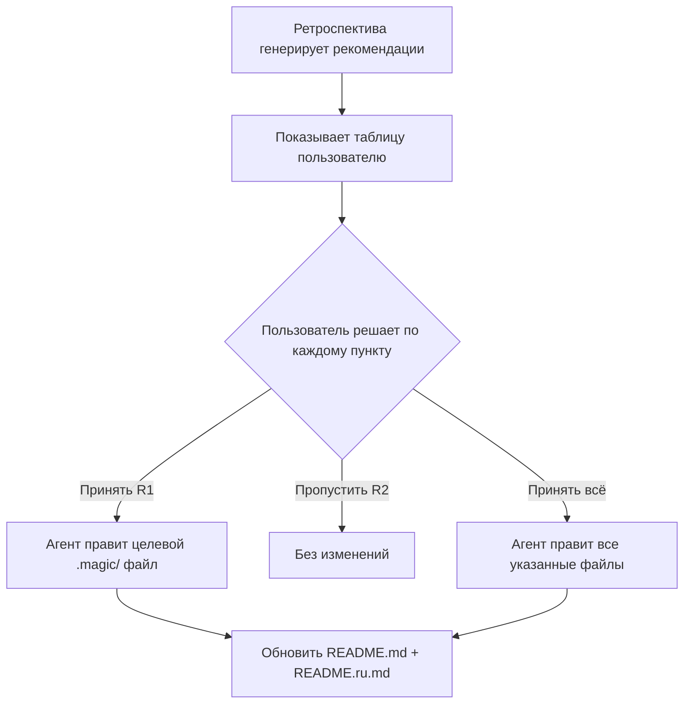

# 🪄 Magic — Система разработки на основе спецификаций (SDD)

Magic — это система и рабочий процесс Specification-Driven Development (SDD), управляемая AI-агентами. Она устанавливает строгий, структурированный конвейер для кодинг-агентов, гарантируя, что **никакой код не будет написан до тех пор, пока спецификация не будет определена, проверена и спланирована.**

Она состоит из набора инструкций в формате Markdown для рабочих процессов AI-агентов, фактически выполняя роль «операционной системы» для агентной разработки.

## 🧭 Ключевая Философия

1. **Сначала Спецификации, Потом Код:** Агенту строго запрещено писать код реализации напрямую из сырых запросов пользователя. Все идеи должны сначала быть преобразованы в структурированную спецификацию (`.design/specifications/*.md`).
2. **Детерминированный Процесс:** Система внедряет строгий конвейер: *Идея → Спецификация → Задача и План → Запуск → Код*.
3. **Управление через «Конституцию»:** Вся логика подчиняется центральному своду правил (`.design/RULES.md`), который выступает в роли живой конституции проекта.
4. **Самосовершенствование:** После каждой фазы и при завершении всего плана воркфлоу Task автоматически запускает ретроспективу — собирает метрики и генерирует рекомендации. Ручная команда не нужна.

## 🩺 Здоровье системы (CLI Doctor)

Вы можете проверить, правильно ли инициализировано ваше SDD-пространство, и выявить любые нарушения без вызова ИИ. Просто добавьте флаг `--doctor` (или `--check`):

```bash
npx magic-spec@latest --doctor
# или
uvx magic-spec --doctor
```

Это вернет визуально отформатированный отчет о валидации структуры вашей папки `.design`, предотвращая поломку контекста до того, как вы начнете писать код.

## 🔗 Конвейер (Pipeline)

Magic работает через **3 основных воркфлоу** и **1 вспомогательный**, формирующих полный жизненный цикл — от сырой идеи до написанного кода со встроенным самоанализом. Инициализация автоматическая и не требует ручной команды.

```mermaid
graph TD
    IDEA["💡 Идея"] --> INIT{"🏗️ Auto-Init<br/>init.md"}
    INIT -->|.design/ есть| SPEC
    INIT -->|.design/ нет| CREATE["Создать структуру .design/"] --> SPEC
    SPEC["📋 Specification<br/>spec.md"] <--> RULE["📜 Rule<br/>rule.md"]
    SPEC --> TASK["🗺️ Task & Plan<br/>task.md"]
    TASK --> RUN["⚡ Run<br/>run.md"]
    RUN --> CODE["🚀 Код"]
    RUN -.->|"авто: фаза завершена"| RETRO["🔍 Retrospective<br/>retrospective.md"]
    RETRO -.-|Петля обратной связи| SPEC

    style INIT fill:#2d333b,stroke:#f0883e,stroke-dasharray: 5 5
    style RULE fill:#2d333b,stroke:#8b949e,stroke-dasharray: 3 3
    style RETRO fill:#2d333b,stroke:#8b949e,stroke-dasharray: 3 3
```



### Основные Воркфлоу

| # | Воркфлоу | Файл | Назначение |
|---|---|---|---|
| 1 | **Specification** | `spec.md` | 📋 Преобразует сырые мысли в структурированные спецификации. Проверяет их соответствие реальному проекту. Статусы: Draft → RFC → Stable → Deprecated |
| 2 | **Task** | `task.md` | 🗺️ Читает Stable-спеки, строит граф зависимостей, извлекает критический путь, создаёт фазовый `PLAN.md` и разбивает на атомарные задачи (`TASKS.md`) |
| 3 | **Run** | `run.md` | ⚡ Выполняет задачи из `TASKS.md` с треками. Режимы: Sequential и Parallel. Автоматически запускает Retrospective по завершении фазы и плана |

### Вспомогательные Воркфлоу

| Воркфлоу | Файл | Назначение |
|---|---|---|
| **Rule** | `rule.md` | 📜 Управляет конституцией проекта (`RULES.md §7`). Добавить / Изменить / Удалить / Показать |
| **Onboard** | `onboard.md` | 🎓 Интерактивный тьюториал, проводящий новых разработчиков через их первый цикл Magic SDD. |

### Auto-Init и Auto-Retrospective

| | Файл | Назначение |
|---|---|---|
| **Init** | `init.md` + `scripts/` | 🏗️ Автоматическая пред-проверка. При первом вызове любого воркфлоу проверяет наличие `.design/`. Если нет — создаёт структуру, `INDEX.md` и `RULES.md`. Ручная команда не нужна |
| **Check Specs** | `spec.md` | ⚖️ Пред-проверка целостности. Запускается перед созданием плана или задач, чтобы убедиться, что спеки соответствуют реальным путям, структуре и конфигам проекта |
| **Retrospective** | `retrospective.md` | 🔍 Вызывается автоматически из `run.md`: Level 1 — снапшот после каждой фазы, Level 2 — полный анализ при завершении всего плана. Не является пользовательской командой |

## 🏗️ Архитектура и Структура Директорий

Система SDD состоит из трёх основных директорий:

1. **`.agent/workflows/magic.*.md`** — Точки входа для AI-агентов (например, slash-команды в Cursor или Claude). Тонкие обёртки (~12 строк каждая), запускающие основные воркфлоу Magic. Всего **5 обёрток**: onboard, specification, plan, task, rule.
2. **`.magic/`** — Ядро SDD-движка: определения воркфлоу, шаблоны, скрипты и документация. Неизменяемо в процессе обычной работы.
3. **`.design/`** — Живое состояние вашего проекта. Все сгенерированные спецификации, планы, задачи и ретроспективы хранятся здесь.

### 📁 Полный Обзор Структуры

```plaintext
project-root/
│
├── .agent/workflows/               # 🎯 Триггеры Агента (точки входа)
│   ├── magic.onboard.md            #    → запускает интерактивный тьюториал
│   ├── magic.rule.md               #    → запускает .magic/rule.md
│   ├── magic.run.md                #    → запускает .magic/run.md
│   ├── magic.spec.md               #    → запускает .magic/spec.md
│   └── magic.task.md               #    → запускает .magic/task.md
│
├── .magic/                     # ⚙️ Движок SDD (логика воркфлоу)
│   ├── README.md               #    Документация (EN)
│   ├── README.ru.md            #    Документация (RU)
│   ├── init.md                 #    Логика авто-инициализации (пред-проверка)
│   ├── onboard.md              #    Тьюториал для новых пользователей
│   ├── retrospective.md        #    Движок самоанализа (вызывается из run.md)
│   ├── rule.md                 #    Воркфлоу управления конституцией
│   ├── run.md                  #    Воркфлоу выполнения задач
│   ├── spec.md                 #    Воркфлоу авторинга спецификаций + шаблоны
│   ├── task.md                 #    Воркфлоу генерации плана и декомпозиции задач
│   └── scripts/                #    Скрытые скрипты движка
│       ├── check-prerequisites.*  # Используются для --doctor
│       ├── generate-context.*     # Авто-сборка CONTEXT.md
│       ├── init.sh             #    macOS / Linux
│       └── init.ps1            #    Windows
│
└── .design/                    # 📦 Состояние Проекта и Артефакты (генерируется)
    ├── INDEX.md                #    Реестр спецификаций (имена, статусы, версии)
    ├── RULES.md                #    Конституция проекта
    ├── PLAN.md                 #    План реализации с разбиением на фазы
    ├── RETROSPECTIVE.md        #    Аналитика использования SDD и рекомендации
    ├── TASKS.md                #    Главный индекс задач
    ├── specifications/         #    Файлы спецификаций
    │   └── *.md
    └── tasks/                  #    Разбивка задач
        └── phase-*.md          #    Отслеживание по фазам (треки и последовательности)
```

## ✅ Руководства для Агентов и Чек-листы

Чтобы предотвратить галлюцинации ИИ, дрейф контекста или пропуск шагов, каждый воркфлоу в Magic требует выполнения **Чек-листа завершения задачи (Task Completion Checklist)**. AI-агенту запрещено завершать операцию или начинать писать код, не предоставив пользователю заполненный и подтверждённый чек-лист.

Каждый пункт чек-листа помечается `✓` (выполнено) или `✗` (пропущено/провалено). Любой `✗` требует объяснения. Задача с неразрешёнными `✗` **не считается завершённой**.

## 🔍 Ретроспектива — Автоматическая Петля Обратной Связи

Ретроспектива — это **механизм самосовершенствования** Magic, встроенный непосредственно в воркфлоу Run. Она замыкает петлю обратной связи, анализируя реальные данные использования SDD и генерируя практические рекомендации. Никакой ручной команды не требуется.

### Двухуровневая Система

| Уровень | Название | Триггер | Стоимость | Вывод |
|---|---|---|---|---|
| **Уровень 1** | Auto-snapshot | Автоматически после завершения каждой фазы | ~10с | Одна строка добавляется в таблицу Snapshots в `RETROSPECTIVE.md` |
| **Уровень 2** | Полная ретроспектива | Автоматически при завершении всего плана | ~2–5 мин | Полный анализ + рекомендации, представленные пользователю |

**Уровень 1** собирает числа молча — никакого анализа, никаких прерываний. Создаёт след метрик для анализа трендов.

**Уровень 2** выполняет глубокий анализ и генерирует рекомендации. Использует историю снапшотов для сравнения трендов и представляет результаты на ревью перед любыми изменениями.

### Зачем это нужно

Без петли обратной связи SDD-система может накапливать:

- 🧊 **Мёртвые чек-листы** — пункты, которые всегда проходят и впустую тратят контекст агента
- 🔄 **Повторяющиеся блокировки** — паттерны блокировки, которые кочуют из фазы в фазу
- 👻 **Фантомные ссылки** — спеки в PLAN.md, которых нет в INDEX.md, и наоборот
- 📉 **Трение воркфлоу** — шаги, которые выглядят хорошо на бумаге, но тормозят реальную работу

### Когда запускается

| Триггер | Уровень | Поведение |
|---|---|---|
| 🏁 Фаза завершена | **Уровень 1** | Auto-snapshot: молча, без прерываний |
| 🎯 Весь план завершён | **Уровень 2** | Полная ретроспектива: запускается автоматически, представляет отчёт |
| 📝 Каждое 5-е обновление спеков | — | Предлагает: *«Запустить ретроспективу?»* (вручную) |
| 🗺️ Реструктуризация плана | — | Предлагает: *«Запустить ретроспективу?»* (вручную) |

### Как Применяются Рекомендации

Ретроспектива — **read-only** диагностика. Она никогда не модифицирует себя сама. Все изменения в файлах `.magic/` требуют явного одобрения пользователя:



> **Правило:** Любая принятая рекомендация, которая модифицирует файл воркфлоу `.magic/`, **обязана** также обновить `.magic/README.md` и `.magic/README.ru.md` для синхронизации документации.

## 🚀 Использование

Просто дайте команду вашему AI-агенту (Cursor, Claude, Gemini или любой терминальный агент). Инициализация автоматическая — никаких команд настройки не нужно.

### Основные Команды

| Команда | Что произойдёт |
|---|---|
| *«Оформи эту мысль в спецификации...»* | Запускает Specification → парсит, маппит и записывает файлы спеков |
| *«Создай план реализации»* | Запускает Task → строит фазовый план с графом зависимостей |
| *«Сгенерируй задачи для Фазы 1»* | Запускает Task → разбивает план на атомарные задачи с треками |
| *«Выполни следующую задачу»* | Запускает Run → берёт и выполняет следующую доступную задачу |

### Вспомогательные Команды (опционально)

| Команда | Что произойдёт |
|---|---|
| *«Проверь соответствие спецификаций проекту»* | Запускает Specification → выполняет Consistency Check (Pre-flight) |
| *«Добавь правило: всегда использовать snake_case именование»* | Запускает Rule → добавляет конвенцию в RULES.md §7 |
| *«Запусти интерактивный тьюториал»* | Запускает Onboard → проводит по шагами SDD |

> **Auto-Init:** При первом вызове любой команды система автоматически проверяет наличие `.design/` и создаёт её, если отсутствует. Ручная инициализация не нужна.
>
> **Auto-Retrospective:** Запускается автоматически внутри воркфлоу Task по завершении фазы и плана. Ручная команда не нужна.

AI автоматически прочтёт соответствующий файл `.md` из `.magic/` и выполнит запрос в рамках системы SDD. Ни одна строчка кода не ускользнёт от конвейера. ✨
