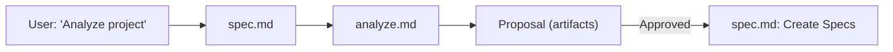

# Analyze — Project Analysis Workflow

This document explains the Project Analysis workflow for bootstrapping specifications from an existing codebase.

## 1. Overview

The Analyze workflow bridges the gap between an existing project and the SDD system. When a developer installs Magic Spec on a project that already has code, this workflow scans the codebase and generates specification proposals.

Key Goals:

- **Discovery**: Automatically detect tech stack, architecture, and key modules from existing code.
- **Bootstrapping**: Generate initial Layer 1 specification proposals based on actual project structure.
- **Re-Analysis**: Compare evolved code against existing specs to find coverage gaps and drift.
- **Safety**: All analysis output is a proposal — no live `.design/` files are modified until explicitly approved.

## 2. How It Works

The Analyze workflow is a **delegated workflow** — it does not have its own slash command. It is invoked through the Specification Workflow (`/spec`) when the agent detects analysis-related triggers.



### 2.1 Trigger Phrases

- *"Analyze project"*, *"Scan project"*
- *"What does this project do?"*, *"Generate specs from code"*
- *"Re-analyze"*, *"Scan for uncovered modules"*

### 2.2 Auto-Suggestion

After initializing `.design/` on a project with existing source code, the Init workflow will display a hint:

```
💡 Existing codebase detected.
   To generate initial specifications from your code, say: "Analyze project"
```

## 3. First-Time Analysis

Used when `.design/INDEX.md` is empty or has no registered specifications.

### What It Scans

| Area | Method | Output |
| :--- | :--- | :--- |
| **Project Structure** | Directory tree scan (depth 2–3) | Project map |
| **Tech Stack** | Config file detection (`package.json`, `pyproject.toml`, etc.) | Stack summary |
| **Architecture** | Directory pattern matching (`controllers/`, `models/`, etc.) | Architecture style + confidence |
| **Modules** | Entry point analysis, import patterns | Module list with dependencies |
| **Conventions** | Linter/formatter configs, test patterns | RULES.md proposals |

### Output

A **Proposal Document** saved to the agent's artifacts directory containing:

- Detected tech stack and architecture style
- List of proposed Layer 1 specifications with scope and evidence
- Proposed entries for RULES.md § Project Conventions
- Coverage summary

The user reviews the proposal and chooses to approve all, select specific items, adjust, or cancel.

## 4. Re-Analysis Mode

Used when `.design/INDEX.md` already contains registered specifications. Compares the current codebase against existing specs to produce a **Gap Report**.

### What It Detects

| Category | Description |
| :--- | :--- |
| ✅ **Covered** | Modules with matching specs |
| ⚠️ **Uncovered** | Code modules with no corresponding spec |
| 🔴 **Orphaned** | Specs referencing code that no longer exists |
| 🔄 **Drifted** | Specs whose described structure doesn't match current code |

### Use Cases

- Project has grown significantly — new modules lack spec coverage
- Major refactoring changed the structure — specs are outdated
- New team member wants to understand current state
- Periodic audit of spec-to-code coverage

## 5. Depth Control

For large projects, the workflow offers scan depth options to balance thoroughness with speed:

| Project Size | Default Behavior |
| :--- | :--- |
| < 50 files | Full scan (no prompt) |
| 50–500 files | Offer Full or Focused scan |
| > 500 files | Recommend Focused or Quick, offer Full |

## 6. Relationship to Other Workflows

| Workflow | Relationship |
| :--- | :--- |
| **Spec** (`spec.md`) | Parent — delegates analysis triggers to `analyze.md` |
| **Init** (`init.md`) | Predecessor — suggests analysis after first initialization |
| **Task** (`task.md`) | Successor — once specs are created from analysis, tasks can be planned |
| **Rule** (`rule.md`) | Consumer — detected conventions are proposed for RULES.md |
