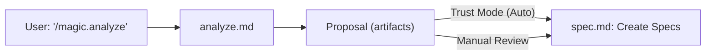

# Analyze — Project Analysis Workflow

This document explains the Project Analysis workflow for bootstrapping specifications from an existing codebase.

## 1. Overview

The Analyze workflow bridges the gap between an existing project and the SDD system. When a developer installs Magic Spec on a project that already has code, this workflow scans the codebase and generates specification proposals.

Key Goals:

- **Discovery**: Automatically detect tech stack, architecture, and key modules from existing code.
- **Bootstrapping**: Generate initial Layer 1 specification proposals based on actual project structure.
- **Re-Analysis**: Compare evolved code against existing specs to find coverage gaps and drift.
- **Safety**: All analysis output is a proposal — no live `.design/` files are modified until explicitly approved.

## 2. How It Works

The Analyze workflow is a **first-class workflow** with its own slash command `/magic.analyze`. It is invoked when the agent detects analysis-related triggers or when explicit project audits are requested.


```mermaid
graph LR
    A["User: '/magic.analyze'"] --> C["analyze.md"]
    C --> D["Proposal (artifacts)"]
    D -- "Trust Mode (Auto)" --> E["spec.md: Create Specs"]
    D -- "Manual Review" --> E
```

### 2.1 Autonomous Dispatch (Trust Mode)

In its latest evolution, the Analysis workflow supports **Auto-Dispatch**. If the engine is in **Trust Mode** and the analysis results are high-confidence (clear structure, well-defined modules), the agent can automatically promote the proposal to active specifications in `.design/` without a manual review gate.

- `/magic.analyze`
- *"Ventilate"*, *"Analyze project"*, *"Scan project"*
- *"What does this project do?"*, *"Generate specs from code"*
- *"Re-analyze"*, *"Scan for uncovered modules"*

### 2.2 Auto-Suggestion

After initializing `.design/` on a project with existing source code, the Init workflow will display a hint:

```
💡 Existing codebase detected.
   To generate initial specifications from your code, say: "Analyze project"
```

## 3. First-Time Analysis

Used when `.design/INDEX.md` is empty or has no registered specifications.

### What It Scans

| Area | Method | Output |
| :--- | :--- | :--- |
| **Project Structure** | Directory tree scan (depth 2–3) | Project map |
| **Tech Stack** | Config file detection (`package.json`, `pyproject.toml`, etc.) | Stack summary |
| **Architecture** | Directory pattern matching (`controllers/`, `models/`, etc.) | Architecture style + confidence |
| **Modules** | Entry point analysis, import patterns | Module list with dependencies |
| **Conventions** | Linter/formatter configs, test patterns | RULES.md proposals |

### Output

A **Proposal Document** saved to the agent's artifacts directory containing:

- Detected tech stack and architecture style
- List of proposed Layer 1 specifications with scope and evidence
- Proposed entries for RULES.md § Project Conventions
- Coverage summary

The user reviews the proposal and chooses to approve all, select specific items, adjust, or cancel.

### 3.4 Ghost Registry Repair Priority (§52)

If the `.design/specifications/` directory contains files that are NOT listed in `INDEX.md`, or vice-versa, the workflow enters **Registry Repair Mode**. It prioritizes mapping existing files to the registry before attempting to analyze new code. This prevents the creation of duplicate specifications for existing logic.

## 4. Re-Analysis Mode

Used when `.design/INDEX.md` already contains registered specifications. Compares the current codebase against existing specs to produce a **Gap Report**.

### What It Detects

| Category | Description |
| :--- | :--- |
| ✅ **Covered** | Modules with matching specs |
| ⚠️ **Uncovered** | Code modules with no corresponding spec |
| 🔴 **Orphaned** | Specs referencing code that no longer exists |
| 🔄 **Drifted** | Specs whose described structure doesn't match current code |
| 📉 **Logic Evolution** | API or internal logic has structurally drifted (>30%) from the spec |

### 4.1 Smart Sync (AOP)

During Re-Analysis, the engine uses content-similarity algorithms to detect **Manual Renames**. If a module was moved or renamed, the engine can "Rescue" the existing specification and remap it to the new location instead of deleting and recreating it, preserving the task history.

### Use Cases

- Project has grown significantly — new modules lack spec coverage
- Major refactoring changed the structure — specs are outdated
- New team member wants to understand current state
- Periodic audit of spec-to-code coverage

## 5. Project Ventilation (Deep Audit)

Project Ventilation (Mode C) is a specialized "deep audit" mode that treats the current codebase as the source of truth and compares it against the entire SDD registry.

### What It Audits

- **Registry Integrity**: Exact string matches for filenames vs `INDEX.md` (detects case-sensitivity issues).
- **Structural Integrity**: Validates that workspace folders, `specifications/` directories, and `workspace.json` scopes exist and match.
- **Coverage Check**: Scans project directories within the active workspace scope and identifies folders with NO corresponding spec file.
- **Rule Validation**: Checks whether the code complies with project-wide or workspace-specific conventions defined in `RULES.md §7`.
- **Engine Integrity**: Compares the `.magic/` folder against `.checksums` to detect unauthorized or corrupted engine changes.

### Use Cases

- Periodic health checks of the SDD system.
- Verifying that manual code edits didn't break spec-to-code mapping.
- Ensuring that all team members are following defined project rules.
- Pre-flight check before major planning or releases.

## 6. Advisory Report

Appended to every analysis report (A–D), the **Advisory Report** provides actionable recommendations beyond simple fixes. It is a chat-only output designed to improve the quality of the project's documentation.

### Categories

- **Spec Quality**: Identifies oversized specs (>300 lines) for splitting, or incomplete stubs.
- **Coverage Strategy**: Prioritizes coverage based on churn (git history) and complexity.
- **Structural Improvements**: Suggests workspace candidates or rule promotions.
- **Action Proposals**: Provides direct commands (e.g., `→ /magic.spec create {name}`) for immediate execution.

## 7. Depth Control

For large projects, the workflow offers scan depth options to balance thoroughness with speed:

| Project Size | Default Behavior |
| :--- | :--- |
| < 50 files | Full scan (no prompt) |
| 50–500 files | Offer Full or Focused scan |
| > 500 files | Recommend Focused or Quick, offer Full |

### 5.1 Workspace Targeting

Pass a workspace name as an optional argument to target a specific workspace directly:

```
/magic.analyze engine
/magic.analyze installers
```

If no argument is given, the workflow resolves the workspace automatically using this priority chain:

| Priority | Source | Behavior |
| :---: | :--- | :--- |
| 1 | Explicit argument | Use it. Unknown name → HALT with available list. |
| 2 | `MAGIC_WORKSPACE` env var | Use silently. |
| 3 | `workspace.json` (single) | Use silently. |
| 3 | `workspace.json` (multiple + default) | Use default. Prints: "Active workspace: {name}." |
| 3 | `workspace.json` (multiple, no default) | Asks: "Which workspace to analyze?" |
| 4 | No `workspace.json` | Scans root `.design/`, logs the fallback. |

### 5.2 Workspace Scoping (C15)

In multi-workspace environments, the Analysis workflow respects the `scope` defined in `workspace.json`. It will strictly ignore files and directories outside the defined scope, allowing for isolated analysis of specific project modules (e.g., only analyzing the `api` or `frontend` folders).

## 8. Relationship to Other Workflows

| Workflow | Relationship |
| :--- | :--- |
| **Spec** (`spec.md`) | Partner — Analysis results are dispatched via the Spec workflow. |
| **Init** (`init.md`) | Predecessor — suggests analysis after first initialization |
| **Task** (`task.md`) | Successor — once specs are created from analysis, tasks can be planned |
| **Rule** (`rule.md`) | Consumer — detected conventions are proposed for RULES.md |

## Sync Note

Synchronized with engine workflows on 2026-03-31 (v1.5.129).
