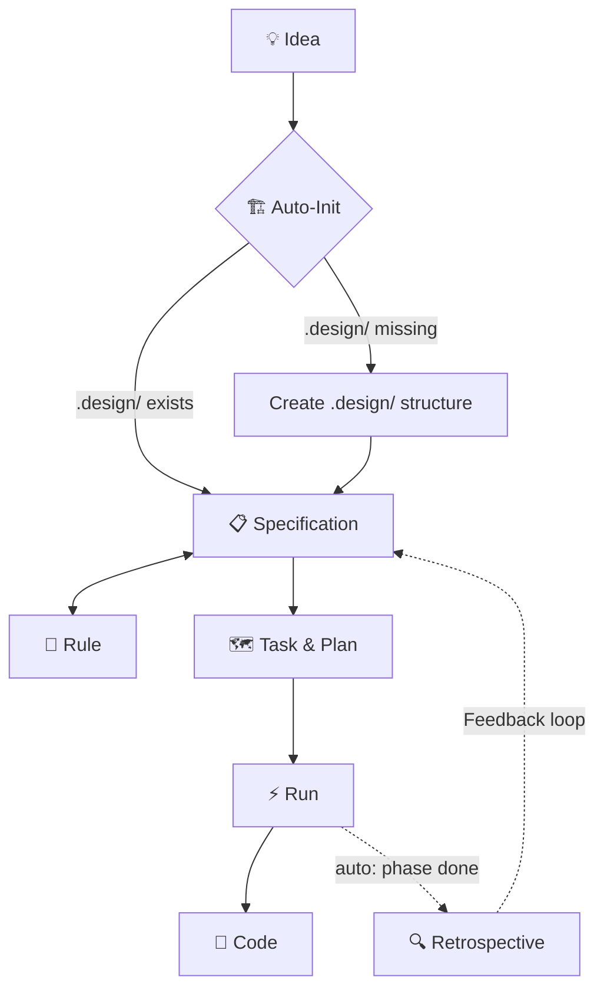

# 🪄 Magic Spec

[](https://www.npmjs.com/package/magic-spec)
[](https://pypi.org/project/magic-spec/)
[](./LICENSE)

**Specification-Driven Development (SDD) workflow for AI coding agents.**

Stop your AI from writing code before it understands the problem.  
`magic-spec` installs a structured pipeline — *Thought → Spec → Task → Run → Code* — directly into any project, regardless of stack.

## ✨ What is Magic Spec?

`magic-spec` is a set of **markdown-based workflow instructions** for AI coding agents (Cursor, Windsurf, Claude, Gemini, etc.). It acts as an project-level operating system for agentic development, enforcing a rigorous, structured pipeline:

```plaintext
💡 Idea  →  📋 Specification  →  🗺️ Task & Plan  →  ⚡ Run  →  🚀 Code
```

Once installed, your AI agent will automatically:

- Build a phased implementation plan with hierarchical dependencies.
- Decompose the plan into prioritized user stories and atomic, trackable tasks.
- Facilitate safe architectural brainstorming via **Explore Mode**.
- Analyze its own workflow and suggest improvements (Auto-Retrospective).
- Provide a smooth onboarding experience with `magic.onboard`.

**No code is written until a specification exists. No spec is implemented without a plan.**

## 🚀 Quick Start

Works with **any project** — Rust, Go, Python, JavaScript, or anything else.  
No runtime lock-in. Requires only Node.js or Python to install.

### Option A — Node.js (npx)

```bash
npx magic-spec@latest
```

### Option B — Python (uvx)

```bash
uvx magic-spec
```

**What gets installed:**

1. `.magic/` — The live SDD engine (logic and scripts).
2. `.agent/workflows/` — Slash-command wrappers for your AI agent.
3. `.design/` — Your project's design workspace (Specs, Plans, Rules).

## 🧭 Core Philosophy

| Principle | Description |
| :--- | :--- |
| **Specs First** | No code is allowed before a specification is accepted. |
| **Deterministic** | A strict, unskippable pipeline from thought to deployment. |
| **Constitutional** | All project conventions live in `RULES.md` — the source of truth. |
| **Self-Improving** | Continuous feedback via built-in auto-retrospectives. |

## 📁 What Gets Installed

```plaintext
your-project/
├── .agent/workflows/         # slash commands (magic.spec, magic.task, etc.)
├── .magic/                   # SDD Engine (workflow logic, read-only)
└── .design/                  # Project Design (INDEX.md, RULES.md, PLAN.md)
```

## 🔗 The Workflow Pipeline



### Core Workflows

| # | Workflow | Purpose |
| :--- | :--- | :--- |
| 1 | **Specification** | Converts raw thoughts into structured specs. Verifies sync. |
| 2 | **Task** | Builds dependency graph, PLAN.md, and atomic task files. |
| 3 | **Run** | Executes tasks and manages retrospectives. |

## 💬 How to Use

Just talk to your AI agent naturally:

- *"Dispatch this thought into specs..."* → Runs Specification workflow
- *"Create an implementation plan"* → Runs Task workflow
- *"Execute the next task"* → Runs Run workflow
- *"Add rule: always use Inter font"* → Runs Rule workflow

## 🔄 Updating

```bash
npx magic-spec@latest --update
# or
uvx magic-spec --update
```

## 🤝 Compatibility

- [Cursor](https://cursor.com) (Rules + Agent mode)
- [Windsurf](https://codeium.com/windsurf) (Cascade + Flows)
- [Claude](https://claude.ai) (Projects)
- [Gemini](https://gemini.google.com)
- [GitHub Copilot](https://github.com/features/copilot)

## 📄 License

[MIT](./LICENSE) © 2026 Oleg Alexandrov
